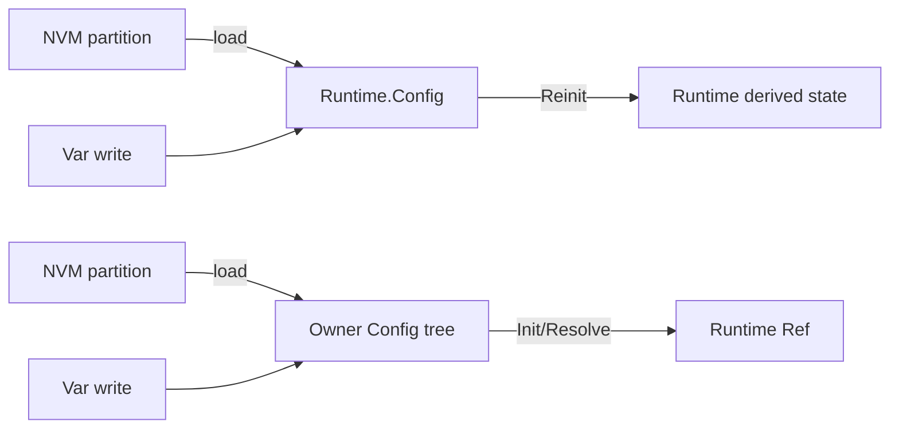
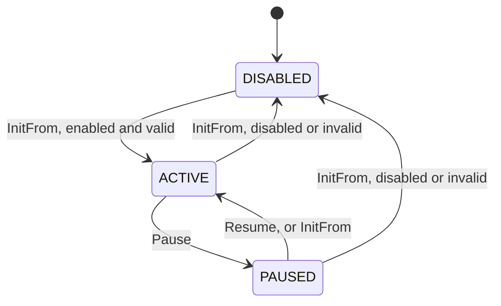

# Config, State, Ref

`Config_T` is declarative data: persisted, written by the user or protocol, read back as written. Runtime state is a separate concern. Each persisted value has **one writable copy**, at the address its NVM partition maps. Anything else derived from it is written only by an Init/Reinit.

## Duplication conditions

Two writable copies appear when both hold:

1. a runtime struct holds its `Config_T`, and
2. another `Config_T` nests that `Config_T`.

Break either one. Breaking neither is the bug class: the var interface writes one copy, NVM saves the other (VBus before 2026-10, `VBus_T.Config.MonitorConfig` and `VBus_T.MonitorState.Config`).

## Option 1 — Configs do not nest (flat partitions)

The runtime struct holds its own `Config_T`, which is its NVM partition. A composite holds sibling runtimes, each with its own partition.

```c
typedef struct VBus
{
    VMonitor_State_T MonitorState;  /* holds the monitor partition, MonitorState.Config */
    VBus_Config_T Config;           /* VSupplyNominal_V, derate floors */
    ...
}
VBus_T;

void VBus_InitMonitor(VBus_T *, const VMonitor_Config_T *);  /* per partition: load, Reinit */
void VBus_InitBase(VBus_T *, const VBus_Config_T *);
void VBus_Reinit(VBus_T *);                                  /* derive from both held partitions */
```

- Config functions take one `Config_T` and do not re-derive. The caller re-derives (`VBus_Reinit`).
- An invariant across partitions is on the runtime holding both: `VBus_Config_Set(VBus_T *, id, value)` re-anchors the monitor thresholds when VSupplyNominal is written, after `VBus_ConfigId_Set(VBus_Config_T *, ...)`.
- Validity is per partition: `VBus_Config_IsValid`, `VBus_MonitorConfig_IsValid`.
- Derivations across partitions make the Init order matter. The VBus derate slopes divide by monitor threshold spans, so the monitor partition loads first.
- Used by: VBus, VMonitor, HeatMonitor, Hall, Encoder, FOC field weakening (`P_FOC_NVM_CONFIG`).

### Overlap between standalone modules

A module that operates on its own keeps its whole Config, even when the composite holding it also holds the source of a field. The composite overrides that field from its source on every init. The module's copy is a mirror: persisted with it, rewritten on load, and authoritative only when the module runs standalone.

| Mirror | Source | Overridden in |
|---|---|---|
| `[VMonitor_Config_T]` `.Nominal` | `[VBus_Config_T]` `.VSupplyNominal_V` | `VBus_Reinit` |
| `[Encoder_Config_T]` `.AngleFreqBase` | `[RotorSensor_UnitRef_T]` `.AngleFreqBase / .PolePairs` | `Encoder_RotorSensor_InitUnits` |

Keep the overlap to a field or two. More overlap means the composite is re-implementing the module.

## Option 2 — Runtime holds a Ref, not a Config

The `Config_T` tree nests freely and lives with its owner or the NVM layer. The runtime struct holds only what is derived from it, re-derived on init and on write.

```c
typedef struct Motor_Config { Motor_Electrical_T Electrical; ... } Motor_Config_T;   /* tick base, persisted */
typedef struct FOC { FOC_Electrical_T Electrical; ... } FOC_T;                       /* speed-base pu, derived */

void Motor_ResolveFocParams(Motor_Context_T *);  /* Foc.Electrical = Motor_Electrical_FocOf(&Config.Electrical) */
```

- Hold the derived fields directly. A separate `Ref_T` earns its place only for a collective property or chunked operation, as `FOC_Electrical_T` passed whole to FOC.
- Raw values the runtime needs as stored are read from the Config at the call site, not copied into the Ref.
- Used by: FOC_Electrical. Available for PID (Kp to gain and shift; `PidI` shared by Iq and Id) and AngleCounter (caller-built `AngleCounter_Ref_T`, nothing persisted).

## Choosing

| Runtime needs from its config | Option |
|---|---|
| values as stored | 1, flat partition held by the runtime |
| a transform of them, or one config shared by several runtimes | 2, Ref held by the runtime |



## Config interface

- `Module_ConfigId_Get/Set` take `Module_Config_T *`. The holder writes, then re-derives (`VMonitor_ConfigId_Set` = `RangeMonitor_ConfigId_Set` + `RangeMonitor_InitFrom`).
- Derivation never overwrites a value the user set. Invalid thresholds resolve the mode to DISABLED, `Config.IsEnabled` keeps what was written. A mirror field is the exception, rewritten from its source (above).
- On/off is a mode on an enum, not a dedicated `bool`. The poll `switch`es on it, and a runtime hold is one more state, never a Config write (written to Config, it would persist on the next NVM save):



  `[RangeMonitor_Mode_T]`, held as `RangeMonitor_T.Mode`. Same shape as `[Monitor_Mode_T]` (DISABLED on the direction), `[Timer_Mode_T]` (DISABLED, STOPPED) and `[UserDIn_Mode_T]`.
- An argument bundle that is never persisted is not a Config. Pass the built Ref (`AngleCounter_InitFrom(p_counter, AngleCounter_Ref(fs, cpr, base))`).
