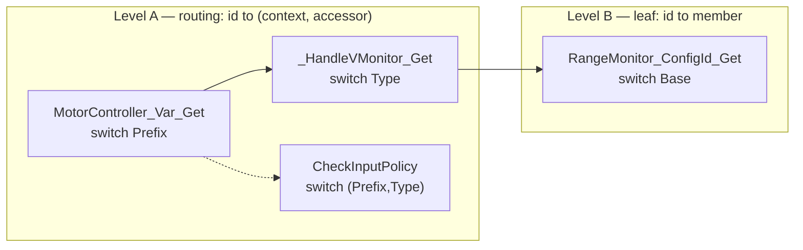

```mermaid
flowchart LR
    A["MotorController_Var_Get<br/>switch Prefix"] --> B["_HandleVMonitor_Get<br/>switch Type"]
    B --> C["RangeMonitor_ConfigId_Get<br/>switch Base"]
    A -.-> P["CheckInputPolicy<br/>switch (Prefix,Type)"]

    subgraph L1["Level A — routing: id to (context, accessor)"]
        A
        B
        P
    end
    subgraph L2["Level B — leaf: id to member"]
        C
    end

```