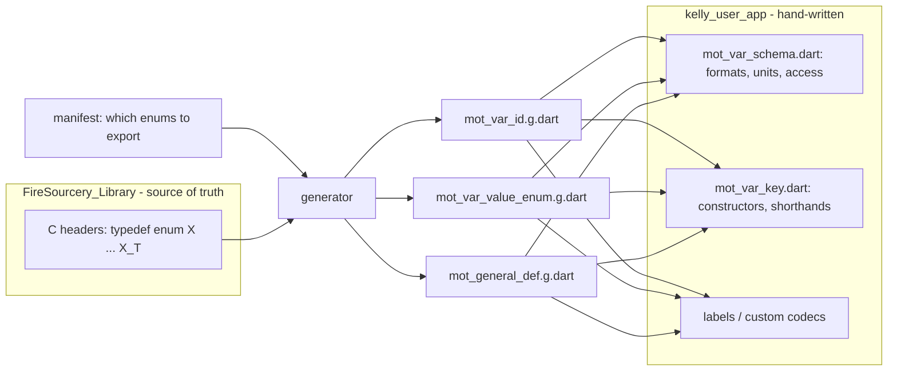
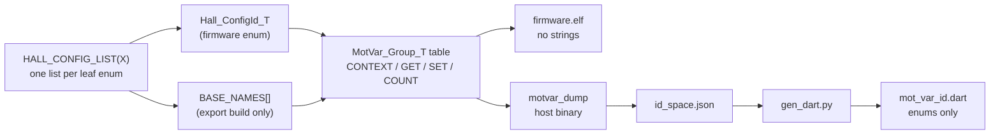

```mermaid
flowchart LR
    subgraph FW[FireSourcery_Library - source of truth]
        H[C headers: typedef enum X ... X_T]
    end
    M[manifest: which enums to export] --> G[generator]
    H --> G
    G --> I[mot_var_id.g.dart]
    G --> V[mot_var_value_enum.g.dart]
    G --> D[mot_general_def.g.dart]
    subgraph APP[kelly_user_app - hand-written]
        S[mot_var_schema.dart: formats, units, access]
        K[mot_var_key.dart: constructors, shorthands]
        L[labels / custom codecs]
    end
    I & V & D --> S & K & L

```

```mermaid
flowchart LR
    L["HALL_CONFIG_LIST(X)<br/>one list per leaf enum"] --> E["Hall_ConfigId_T<br/>(firmware enum)"]
    L --> N["BASE_NAMES[]<br/>(export build only)"]
    E --> T["MotVar_Group_T table<br/>CONTEXT / GET / SET / COUNT"]
    N --> T
    T --> FW["firmware.elf<br/>no strings"]
    T --> D["motvar_dump<br/>host binary"]
    D --> J["id_space.json"]
    J --> G["gen_dart.py"]
    G --> DA["mot_var_id.dart<br/>enums only"]
```