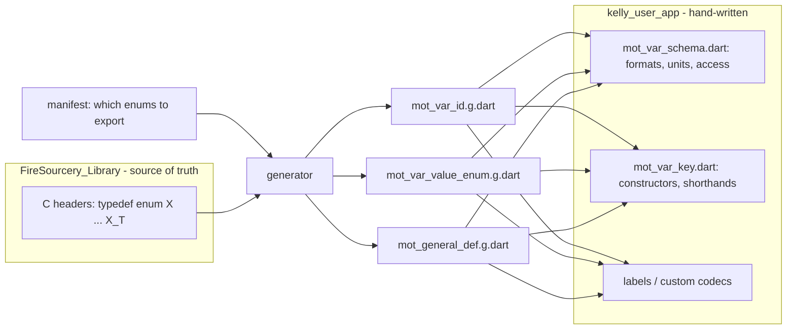

```mermaid
flowchart LR
    subgraph C["C group table row"]
      D["array designator<br/>MOTOR_VAR_TYPE_USER_OUT"]
      T["META type<br/>Motor_Var_UserOut_T"]
    end
    subgraph E["base enum, ordered"]
      M["[0] MOTOR_VAR_SPEED<br/>[1] MOTOR_VAR_I_PHASE<br/>[2] MOTOR_VAR_V_PHASE"]
    end
    subgraph V["MotVarId"]
      W["Type = 0<br/>Base = n"]
    end
    subgraph S["CSV row"]
      O["id_object"]
      B["id_base"]
    end
    D --> O
    D --> W
    T --> M
    M -- "member[Base]" --> B
    M -- "index" --> W
````