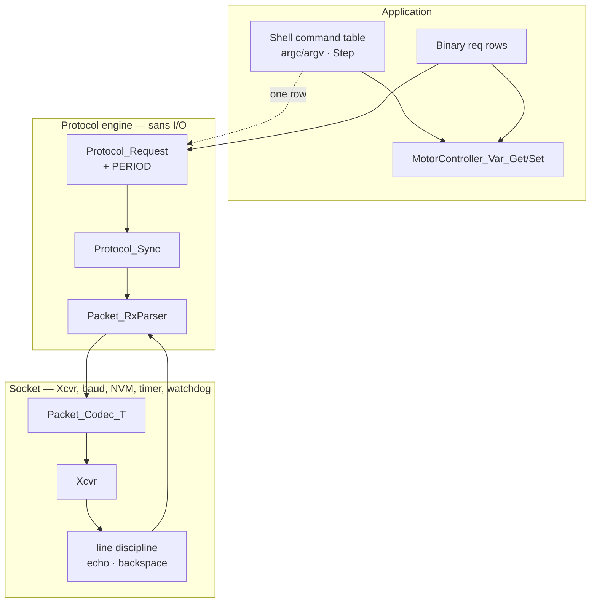

```mermaid
flowchart TB
    subgraph app["Application"]
        cmds["Shell command table<br/>argc/argv · Step"]
        reqs["Binary req rows"]
        var["MotorController_Var_Get/Set"]
    end
    subgraph eng["Protocol engine — sans I/O"]
        dispatch["Protocol_Request<br/>+ PERIOD"]
        sync["Protocol_Sync"]
        parser["Packet_RxParser"]
    end
    subgraph sock["Socket — Xcvr, baud, NVM, timer, watchdog"]
        codec["Packet_Codec_T"]
        line["line discipline<br/>echo · backspace"]
        xcvr["Xcvr"]
    end

    cmds --> var
    reqs --> var
    cmds -.one row.-> dispatch
    reqs --> dispatch
    dispatch --> sync --> parser --> codec
    codec --> xcvr
    line --> parser
    xcvr --> line
```
