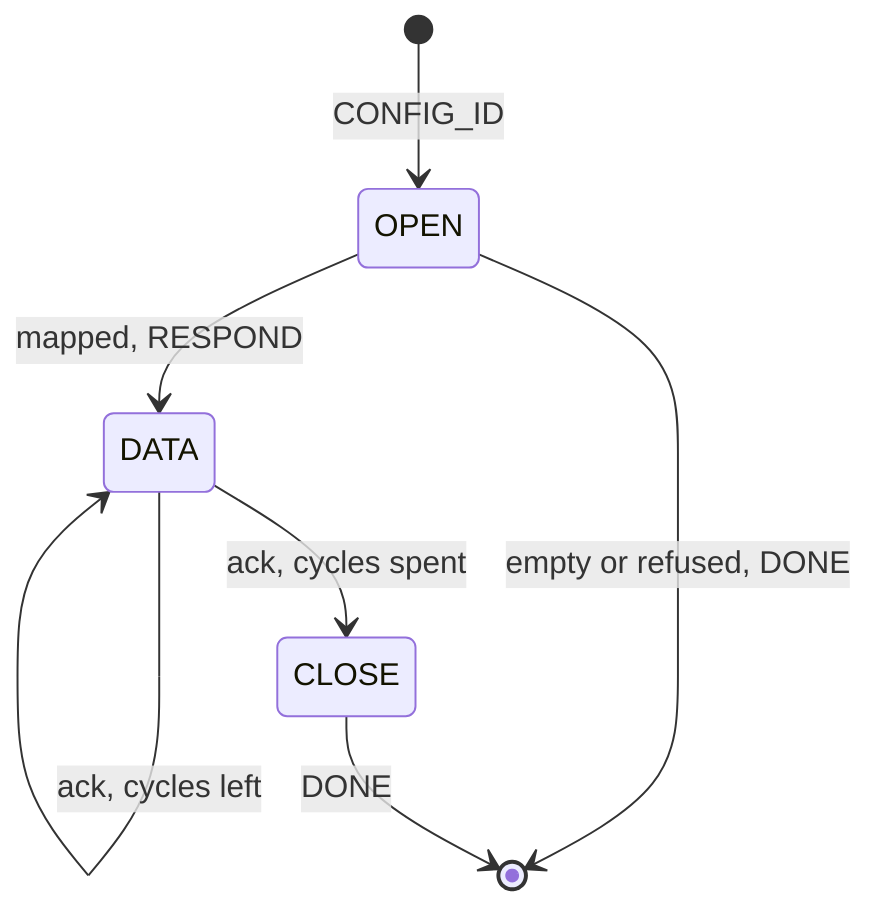

Var streaming mode over the request engine.

The opening request carries a mapping - a list of var ids and the width each occupies -
and the device answers with one frame per pacing ack until the run ends. The mapping, not
code, says what a datagram's bytes are: values are read through [Datagram_GetFn_T], in map
order, packed at the offsets the widths imply.

    CONFIG_ID frame     the mapping and the run length. Replaces any previous mapping.
    DATA_ID frame       one datagram. Raw values - no ids, no status, no per-entry framing.

Register with PROTOCOL_ACK_ON_REQ: each datagram is answered by an ack and that ack pulls
the next, which is the ack-paced stream [Protocol_DataMode_Read] already runs on. The
engine re-enters a bound handler only on a frame or an ack, so the host paces the run and
the device never pushes unbidden - there is no device-paced periodic mode here. A run ends
on its cycle budget, on an abort frame, or on REQ_TIMEOUT.

A mapping is installed whole or not at all. The opening request is recognised by its id
and rewrites every field of the run, so a run cannot inherit half of a previous one out of
P_SUB_STATE - and a refused mapping leaves nothing mapped rather than something stale.
That is also why a stop is a mapping of zero entries.

[Datagram_Begin] and [Datagram_Build] take a [Datagram_State_T] rather than reaching into
the sub-state, so an application holding its own mapping.