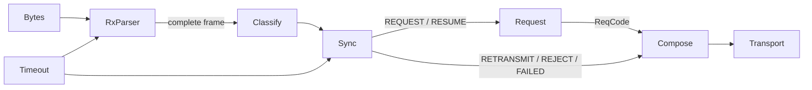
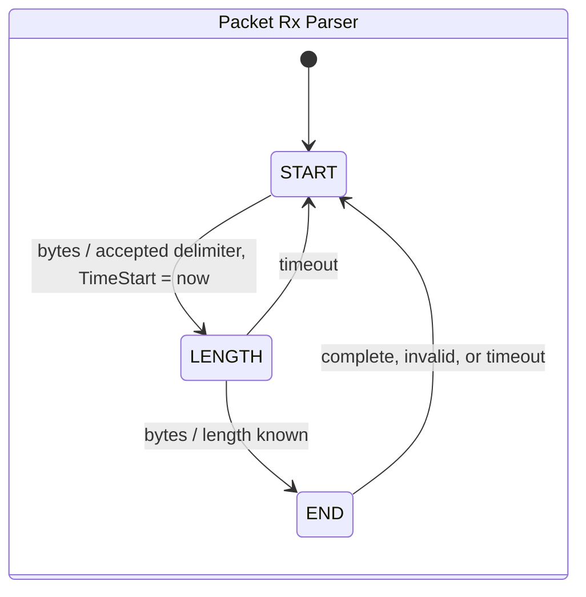

```mermaid
flowchart LR
    Bytes --> RxParser
    RxParser -->|complete frame| Classify
    Classify --> Sync
    Timeout --> RxParser
    Timeout --> Sync
    Sync -->|REQUEST / RESUME| Request
    Request -->|ReqCode| Compose
    Sync -->|RETRANSMIT / REJECT / FAILED| Compose
    Compose --> Transport
```

```mermaid
stateDiagram-v2
    state "Packet Rx Parser" as Rx {
        [*] --> START
        START --> LENGTH: bytes / accepted delimiter, TimeStart = now
        LENGTH --> END: bytes / length known
        LENGTH --> START: timeout
        END --> START: complete, invalid, or timeout
    }
```