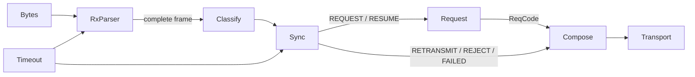
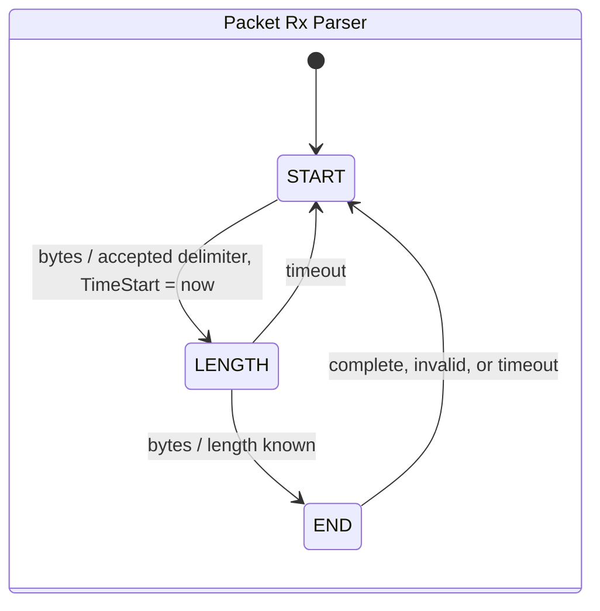

/******************************************************************************/
/*
    Flow traces - the four shapes the request table actually uses.
*/
/******************************************************************************/
/*
    Stateless (VarRead) - PROTOCOL_ACK_NONE

    Parse:      COMPLETE
    Class:      DATA
    Sync:       OPEN + DATA -> REQUEST
    Request:    Select, no ack, PROC -> DONE, TxMeta.Length set
    Compose:    DONE -> Tx response. OnTx: RX_ACK_OPEN = 0 -> stays OPEN
    One pass. No state persists.
*/

/*
    Stateless with ack (CallExt) - PROTOCOL_ACK_ON_REQ

    Pass 1:
    Sync:       OPEN + DATA -> REQUEST
    Request:    Select, TX_ACK_OPEN -> Tx ACK, PROC -> DONE
    Compose:    Tx response. OnTx: RX_ACK_OPEN -> AWAIT_ACK

    Pass N:
    Class:      ACK
    Sync:       AWAIT_ACK + ACK -> RESUME, back to OPEN
    Request:    IDLE, nothing to resume -> exchange closed
*/

/*
    Stateful stream (DataModeRead) - PROTOCOL_ACK_EVERY_STEP, ack-paced

    Pass 1:
    Request:    Select, Tx ACK, PROC(Step 0) -> RESPOND, chunk staged
    Compose:    Tx response -> AWAIT_ACK

    Pass N:
    Sync:       AWAIT_ACK + ACK -> RESUME
    Request:    ACTIVE, PROC(Step n) -> RESPOND, next chunk
    Compose:    Tx response -> AWAIT_ACK

    Final:
    Request:    PROC -> DONE -> IDLE
*/

/*
    Stateful sink (DataModeWrite) - data-paced, handler validates

    Pass 1:
    Request:    Select, PROC(Step 0) -> AWAIT. Nothing transmitted, stays ACTIVE.

    Pass n:
    Sync:       OPEN + DATA -> REQUEST
    Request:    ACTIVE, TX_ACK_STEP -> Tx ACK, PROC -> ACCEPT or REJECT
    Compose:    ACCEPT -> Tx ACK.  REJECT -> Tx NACK.

    With TX_ACK_STEP = 0 the handler's ACCEPT is the only ack, so the remote learns the
    chunk was not merely received but validated.
*/

/******************************************************************************/
/*!
*/
/******************************************************************************/