# State Machine Architecture

A hierarchical state machine stored as a parent-pointer tree of const `[State_T]` nodes in ROM. One pointer in RAM, `[StateMachine_Active_T].p_ActiveState`, is the leaf. The active configuration is the path from that leaf up to its root. There is no region array, no history state, and no heap.

Motor control is the reference user: PWM-thread periodic output, main-thread inputs, and substates mounted by other translation units onto a published root.

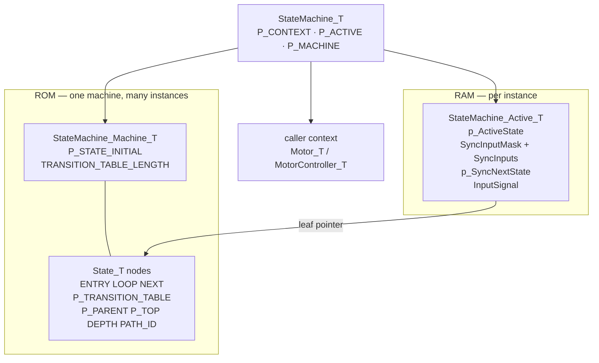

`[StateMachine_T]` is a const handle. Behavior lives in the state nodes. Mutable machine state is the active pointer plus two input buffers. Domain state lives in `P_CONTEXT`, which every handler receives as `void *`.

---

## Layers

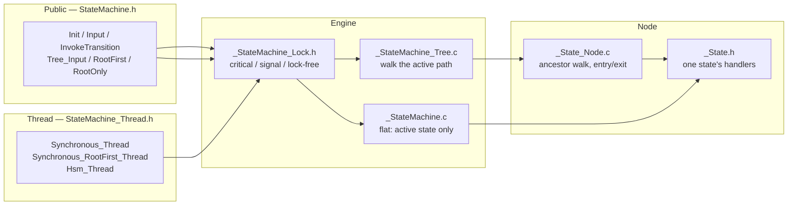

| File | Role |
| --- | --- |
| [State.h](State.h) | `[State_T]` and handler types |
| [State_PathId.h](State_PathId.h) | 4-bit × 8 packed path id |
| [_State.h](_State.h) | Call one state's `LOOP` / `NEXT` / table / entry / exit |
| [_State_Node.c](_State_Node.c) | Tree relations and the up/down walk |
| [_StateMachine.c](_StateMachine.c) | Flat machine: the active pointer is the only state consulted |
| [_StateMachine_Tree.c](_StateMachine_Tree.c) | Hierarchical machine: walk leaf toward root |
| [_StateMachine_Lock.h](_StateMachine_Lock.h) | ISR vs input synchronization, selected at compile time |
| [StateMachine.h](StateMachine.h) | Instance handle and the locked public API |
| [StateMachine_Thread.h](StateMachine_Thread.h) | Periodic compositions of the proc steps |

A flat caller uses `_StateMachine_*`. A hierarchical caller uses `_StateMachine_Branch_*` or `_StateMachine_RootFirst_*`. The public wrappers in [StateMachine.h](StateMachine.h) pick one and add the lock.

---

## The state node

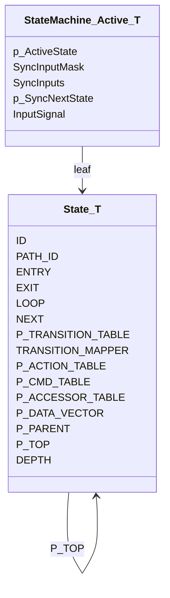

Handlers are optional except a top-level `LOOP`, which the flat and root-first paths call without a null check. `EXIT` exists only when `STATE_MACHINE_EXIT_FUNCTION_ENABLE` is defined; otherwise exit is compiled out and entry alone carries transition work.

| Handler | When it runs | Return |
| --- | --- | --- |
| `ENTRY` | On the way down into a newly entered node | void |
| `EXIT` | On the way up out of a node being left | void |
| `LOOP` | Every proc cycle, if this node is the one selected | void |
| `NEXT` | Immediately after that node's `LOOP` | next `[State_T *]`, or `NULL` to stay |
| `P_TRANSITION_TABLE[id]` | An input whose id is below `STATE_INPUT_MAPPER_START_ID` | same |
| `TRANSITION_MAPPER` | An input id at or above that threshold | a `[State_Input_T]`, or `NULL` if refused |
| `P_ACTION_TABLE` | Explicit action call, no transition | void |
| `P_CMD_TABLE` / `P_ACCESSOR_TABLE` | Value access, no transition, no lock | value |

`NEXT` is a clock-only transition kept off the input table so a child can reuse a parent's `LOOP` and replace only the completion check. A child that defines `NEXT` stops the upward walk: the first non-`NULL` next-state wins.

### What a handler return means

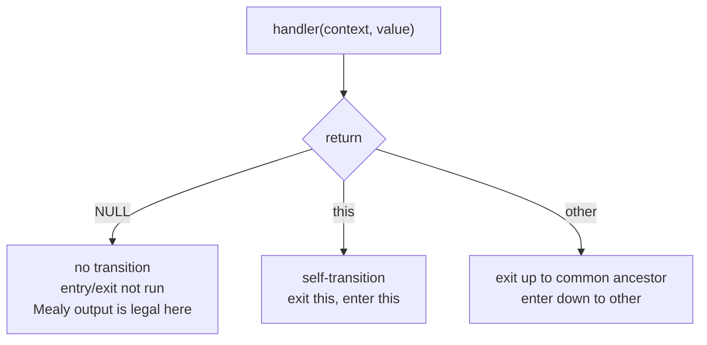

Returning `this` is how [MOTOR_STATE_RUN](../../Motor/Motor/StateMachine/Motor_StateMachine.c) re-enters itself when feedback mode changes, so `Run_Entry` re-matches the control loops. Returning `NULL` after mutating context is an internal transition: direction and feedback writes in `DEACTIVATED` do this.

Input acceptance and transition are separate. The walk stops at the first state that *maps* the id, even when that handler returns `NULL`. A child that maps an id and refuses it shadows the parent. A child that leaves the slot `NULL` does not.

```mermaid
flowchart LR
    id["state_input_t"] --> Q{"id < 0x100"}
    Q -->|yes| TAB["P_TRANSITION_TABLE&#91;id&#93;"]
    Q -->|no| MAP["TRANSITION_MAPPER(id)"]
    TAB --> FN["State_Input_T or NULL"]
    MAP --> FN
```

`STATE_INPUT_MAPPER_ID(base, sub)` keeps the low 8 bits as a table index and puts the extension in the high bits. Top states use the table. A subtree that needs its own alphabet uses the mapper, or it passes a `[State_T *]` through an existing table slot — that is how calibration and open-loop commands select a substate without growing the shared input enum.

---

## The tree

A root has `P_PARENT == NULL` and `DEPTH == 0`. A substate sets `P_PARENT`, `P_TOP` (the root of its branch), and `DEPTH`. `P_TOP` is a compile-time cache so root-first dispatch does not walk.

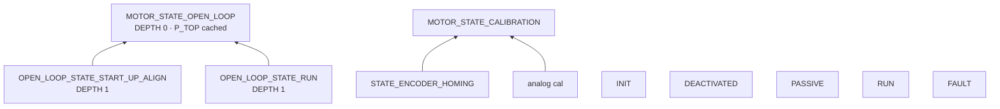

The motor roots are siblings, not a trunk with everything nested under `INIT`. A transition from `PASSIVE` to `OPEN_LOOP_STATE_START_UP_ALIGN` still runs `OPEN_LOOP.ENTRY` on the way down, because the common ancestor is above both roots (`NULL`). That is why a handler may return a leaf in another branch and the entry order stays root-then-leaf.

Substates are `const` objects in whichever file owns them. [Motor_OpenLoop.c](../../Motor/Motor/StateMachine/Motor_OpenLoop.c), [Motor_Encoder.c](../../Motor/Motor/Sensor/Encoder/Motor_Encoder.c), and [MotorController_Analog.c](../../Motor/MotorController/MotorController_Analog.c) each mount onto a published root. The machine definition does not list them.

### Active path

`p_ActiveState` is always the leaf. "Is this state active?" is "is it the leaf, or an ancestor of the leaf?"

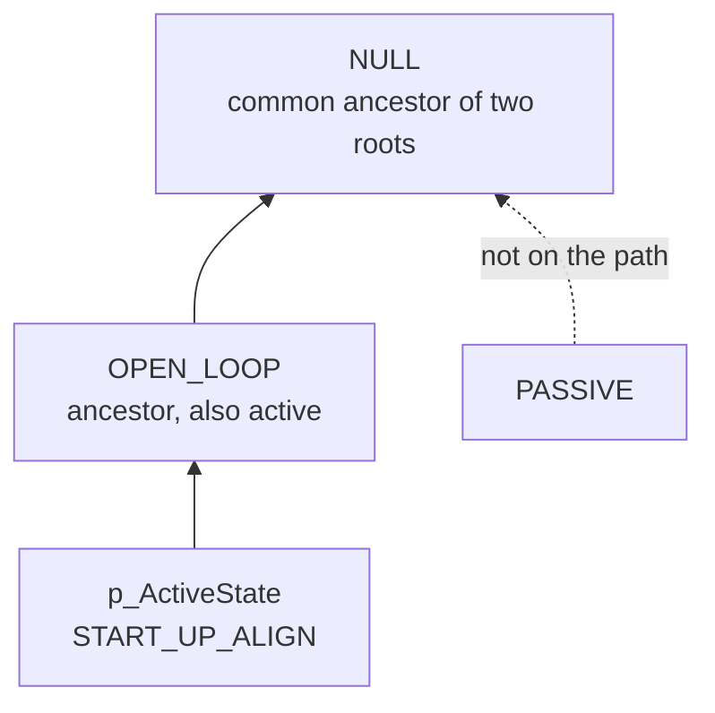

| Query | Meaning |
| --- | --- |
| `State_IsAncestorOrSelf` | test lies on the active path |
| `State_IsDirectLineage` | test is the leaf, an ancestor, or a descendant |
| `State_CommonAncestorOf` | deepest node shared by two paths; self yields the parent |
| `StateMachine_IsActiveBranch` | a compile-time command is legal right now |

`State_CommonAncestorOf` equalizes depth, then walks both pointers until they meet. Self-transition is the special case: the two nodes are already equal, and the parent is returned so entry still runs on the node itself.

### Entry and exit

Exit walks up, including the start, excluding the common ancestor. Entry recurses to the ancestor, then calls `ENTRY` on the way back down. The common ancestor is not exited and not re-entered.

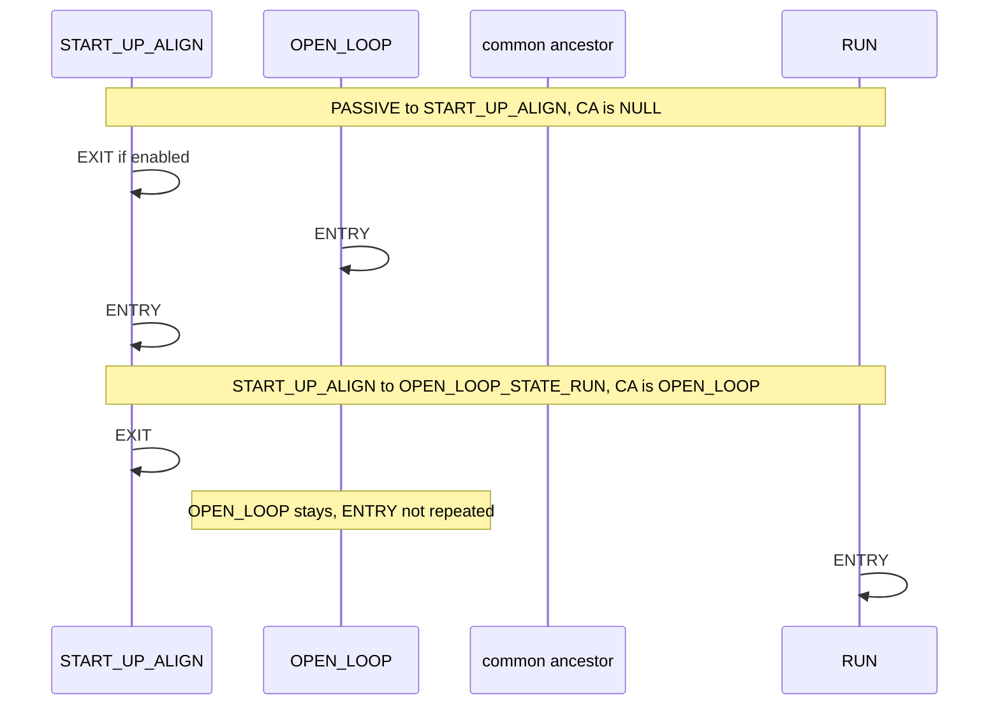

Documented cases in [State_TraverseEntryExit](_State_Node.c):

| From | To | Common ancestor | Effect |
| --- | --- | --- | --- |
| RootX | RootY | `NULL` | exit RootX, enter RootY |
| RootX | LeafY | `NULL` | exit RootX, enter RootY then LeafY |
| LeafX | LeafY, different branches | shared node or `NULL` | exit up to but not including CA, enter down excluding CA |
| RootX | its own LeafX | RootX | no exit, enter the leaf |
| LeafX | its own RootX | RootX | exit the leaf, do not re-enter the root |
| RootX | RootX | parent | enter RootX only |
| LeafX | LeafX | parent | enter LeafX only |

The leaf-to-own-root case does not re-enter the root. That diverges from the UML reading where the destination always runs entry. Callers that need the root entry again return the root as a self-transition target, or return a sibling leaf so the root is the CA and is left alone on purpose. [Motor_Hall.c](../../Motor/Motor/Sensor/Hall/Motor_Hall.c) resets feedback in the substate entry because the parent entry will not run again on the way back.

`ExitUp` is a no-op unless `STATE_MACHINE_EXIT_FUNCTION_ENABLE` is set. Transition work in this tree is written in `ENTRY`.

---

## One proc cycle

Hierarchical proc is three steps, in this order:

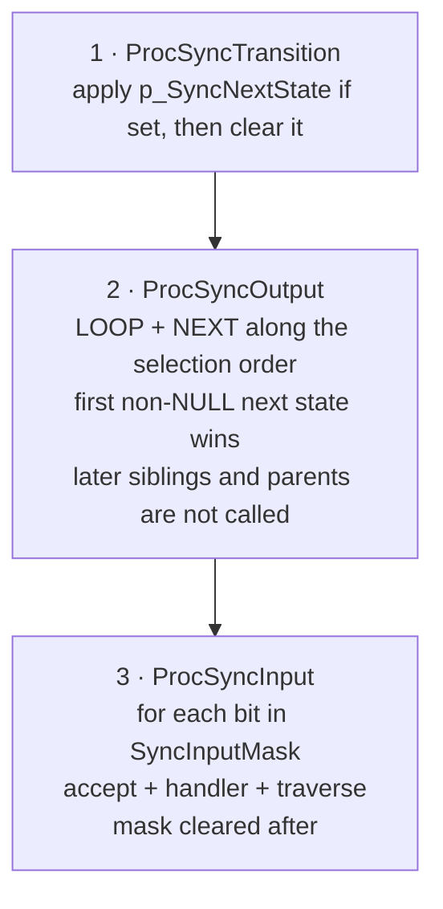

Pending async input is applied before `LOOP`, so an input posted last cycle is visible to this cycle's output. Inputs posted during this cycle wait until the next proc. Output is taken before buffered sync inputs, so a sync-input transition is one cycle behind `LOOP`.

`_StateMachine_Branch_Proc` runs all three and walks leaf-first. The motor thread does not: it calls only `_StateMachine_Branch_ProcSyncOutput`, and user inputs transition immediately on the main thread.

### Selection order

Two walks. Leaf-first is the branch machine. Root-first is the preemptive machine.

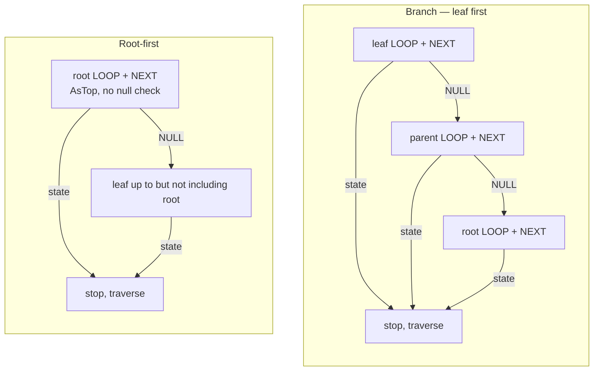

Leaf-first lets an inner completion (`StartUpAlign_Next` returning `OPEN_LOOP_STATE_RUN`) win over a parent that would also transition. Root-first lets a safety root preempt every child: the root is asked once, and only if it returns `NULL` does the walk continue from the leaf up to, but not through, the root.

Input acceptance uses the same two orders.

| Order | Output | Input |
| --- | --- | --- |
| Leaf first | `State_TransitionOfOutputUp` | `State_AcceptInputUp` |
| Root, then the rest | `State_TransitionOfOutput_RootFirst` | `State_AcceptInput_RootFirst` |
| Root only | `State_TransitionOfOutput_AsTop` | `State_AcceptInput_AsTop` |

`AsTop` indexes the table with `(uint8_t)id` and asserts `DEPTH == 0` and a non-NULL table. It is the flat-machine path as well: a flat active state is treated as a root.

### Flat vs tree transition

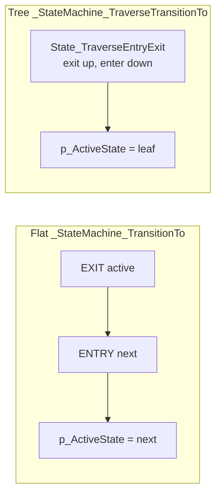

Flat exit/entry is one node each. A flat transition into a leaf does not run the ancestors' entries. Hierarchical callers must use the traverse functions. `StateMachine_ForceTransition` is the flat unconditional set; it is for a known top-level target such as a fault root, not for entering a leaf under another root.

---

## Inputs

Three ways an external event becomes a transition. They differ in *when* the handler runs and *when* `p_ActiveState` changes.

```mermaid
sequenceDiagram
    participant User as input thread
    participant Buf as Active RAM
    participant Proc as proc thread

    Note over User,Proc: Async — handler and traverse now
    User->>User: AcquireAsyncInput
    User->>User: accept + handler + TraverseTransition
    User->>User: ReleaseAsyncInput

    Note over User,Proc: SyncTransition — handler now, traverse next proc
    User->>User: accept + handler
    User->>Buf: p_SyncNextState = result if non-NULL
    Proc->>Buf: ProcSyncTransition
    Proc->>Proc: TraverseTransition

    Note over User,Proc: SetInput — neither now
    User->>Buf: SyncInputs&#91;id&#93; = value, set bit
    Proc->>Buf: ProcSyncInput walks set bits
    Proc->>Proc: accept + handler + traverse
    Proc->>Buf: clear mask
```

| API | Handler runs | Active pointer updates | Overwrite rule |
| --- | --- | --- | --- |
| `InputAsyncTransition` / `Tree_Input` | on the call | on the call | last caller to acquire the lock |
| `InputSyncTransition` | on the call | next proc, before `LOOP` | non-`NULL` only; a refuse does not clear a pending transition |
| `SetInput` | next proc, after `LOOP` | next proc | one slot per id; last write to that id wins; distinct ids all run |

`SetInput` is the one that cannot delay `LOOP`: it only writes a slot and a bit. The proc thread evaluates acceptance, so a state change between set and proc is handled against the state that is active then.

`Tree_Input` is leaf-first async. `Tree_InputRootFirst` asks the root before the leaf. `Tree_InputRootOnly` never asks a child — a top-level fault or mode command that must not be shadowed.

### Compile-time commands

`[StateMachine_TransitionCmd_T]` is an input that already names its start state and its handler. No table lookup.

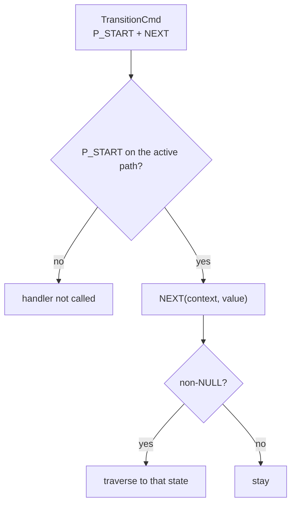

Flat `InvokeTransition` requires `P_START ==` the active pointer. Tree `InvokeTransition` requires `P_START` to be the leaf or an ancestor, so one command published on `OPEN_LOOP` is legal from every open-loop substate. That is how [Motor_OpenLoop_SetAngleAlign](../../Motor/Motor/StateMachine/Motor_OpenLoop.c) and [MotorController_Lock_CalibrateAdc](../../Motor/MotorController/MotorController_Analog.c) enter a private substate without a shared input id.

The handler is still an ordinary `[State_Input_T]`. It may return `NULL` and only mutate context (`OpenLoop_Jog`), or return a private `[State_T]` (`OpenLoop_AngleAlign`).

### Branch entry by pointer

A shared input can carry a `[State_T *]` and let the root decide. `PASSIVE` accepts `MOTOR_STATE_INPUT_OPEN_LOOP` with a pointer; if that pointer's `P_TOP` is `OPEN_LOOP` and speed is zero, the handler returns the leaf. Traverse then enters `OPEN_LOOP` and the leaf, in that order. The same shape is `CALIBRATION` accepting a calibration leaf, and `OPEN_LOOP` accepting a new open-loop leaf or `NULL` to leave.

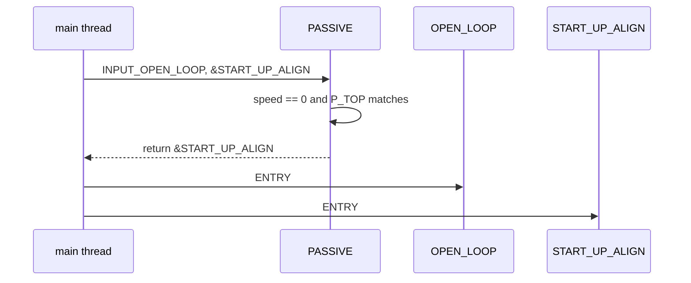

---

## Threads and the lock

Proc runs at higher priority than input (PWM ISR vs main). The thing being protected is the active pointer and the entry/exit pair, not the domain math inside a handler.

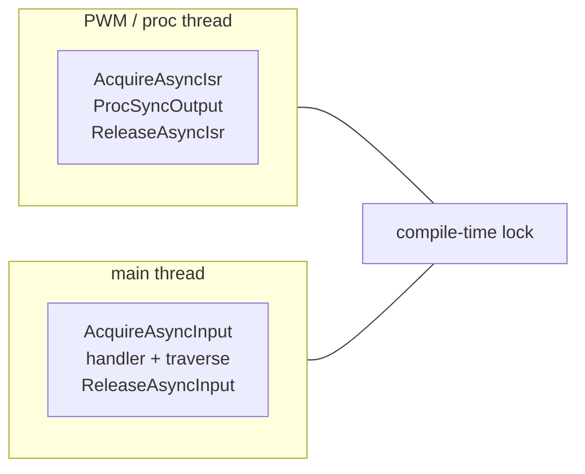

Selected by one define:

| Define | Proc thread | Input thread | If the other side is in a handler |
| --- | --- | --- | --- |
| `STATE_MACHINE_ASYNC_CRITICAL` | no extra lock; ISR may still be masked by the input side | disables IRQ for the whole handler + traverse | input waits out the ISR by masking; ISR does not run mid-transition |
| `STATE_MACHINE_ASYNC_SIGNAL` | skips the cycle if `InputSignal` is held | skips the input if proc holds it | an input can be missed; proc can be skipped |
| neither (`STATE_MACHINE_ASYNC_LOCK_FREE`) | runs | runs | caller guarantees one thread, or uses `SetInput` only |

`STATE_MACHINE_ASYNC_CRITICAL` is the motor-controller configuration. Signal mode exists so a long input need not mask every IRQ, at the cost of dropped inputs. Lock-free is for a machine whose proc and input are already the same thread.

Two narrower locks sit beside that:

- `AcquireSyncInput` guards only the `SetInput` slot write against `ProcSyncInput`. `LOOP` does not take it, so a buffered input cannot stall the periodic output. Default is lock-free; `STATE_MACHINE_SYNC_INPUT_SIGNAL` enables the flag.
- `AcquireAsyncTransition` always masks IRQ. `ForceTransition` and `InvokeTransition` use it because they change the active pointer without going through the input-acquire path.

Inside a critical section the order is entry, then publish:

Publishing after entry means the new state's `LOOP` cannot run before its `ENTRY`. The cost, if this ran unlocked, is the old `LOOP` running after the new `ENTRY`. The lock exists so that window is closed. A handler that itself depends on `p_ActiveState` already matching the node being entered is wrong under this order; handlers receive `P_CONTEXT`, not the active pointer.

---

## Path id

Leaf `ID` is unique only among siblings. Two branches may both use `1`. `[State_PathId_T]` packs the whole path into one `uint32_t`: 4 bits per level, depth 0 in the low nibble, eight levels, 15 ids per level.

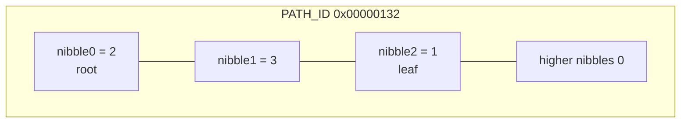

Id `0` at depth ≥ 1 means "no state at this level". That is why depth can be recovered from the value alone, and why a substate id space starts at 1. Root id `0` is legal.

A node that leaves `PATH_ID` at zero reads as root id 0, which is a valid path, so omission is not detectable by inspection. `State_IsPathIdValid` rebuilds the id by walking `P_PARENT` and accepts either an exact match or, for a substate, a match against the parent id. The second form is how an unnumbered substate reports as its root until an id is allocated. `StateMachine_GetPathId` asserts that check.

`MC_STATE_LOCK_CALIBRATE_ADC` is the numbered form: `.PATH_ID = { .Depth0 = MC_STATE_ID_LOCK, .Depth1 = MC_LOCK_SUB_ID_CALIBRATE_ADC }`. Motor open-loop and calibration children still publish only the root nibble, so `Motor_GetPathId` returns the root id while those leaves are active.

---

## What is not in the machine

Orthogonal regions are not implemented. One leaf, one path. A comment in `[StateMachine_Active_T]` marks `pp_OrthogonalStates` as the place a second region would hang; nothing reads it.

History is not stored. Re-entering a root starts at the root unless the handler returns a specific leaf.

`P_LINK_NEXT` / `P_LINK_PREV` are menu links behind `STATE_MACHINE_LINKED_STATES_ENABLE`. They are not the transition graph.

`Extension/_StateMachine_FaultState.c` is a template gated by `STATE_MACHINE_FAULT_STATE_ENABLE`. The motor machine does not use it; fault is an ordinary root whose table slot ORs flag bits and returns `FAULT` or `DEACTIVATED`.

---

## Motor instance, as wired

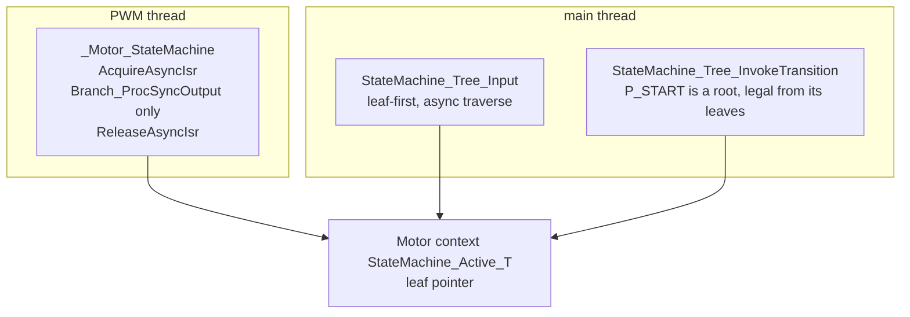

Roots: `INIT`, `DEACTIVATED`, `PASSIVE`, `RUN`, `INTERVENTION`, `OPEN_LOOP`, `CALIBRATION`, `FAULT`. Initial state is `INIT`. Shared input ids are fault, phase output, feedback mode, direction, open loop, calibration.

`INIT.NEXT` waits out a millisecond count, then returns `FAULT` or `DEACTIVATED`. `DEACTIVATED` is the only door into calibration. `PASSIVE` turns phase-PWM plus a live sensor into `RUN`. `RUN` releases to `PASSIVE` or to an intervention leaf. Open-loop and calibration leaves are private `const` nodes whose `P_TOP` is the published root; commands on that root are valid for the whole branch.

The controller machine is a second instance of the same framework, with its own input enum and its own substate id space under `MAIN` and `LOCK`. An application mounts further leaves under `MAIN` the same way a sensor mounts leaves under `CALIBRATION`: a `const State_T` in its own file, `P_PARENT` set to the published root.

---

## Adding a state

A root:

1. Give it an id in the machine's root enum, a `PATH_ID` nibble at depth 0, and a `P_TRANSITION_TABLE` of `TRANSITION_TABLE_LENGTH`.
2. Define `LOOP`. Define `ENTRY` for transition work. Define `NEXT` only for a clock transition.
3. Map every accepted input. Leave refused inputs `NULL` so a child, or a leaf-first walk, can still see a parent — a root has no parent, so `NULL` there means the input is ignored.

A leaf:

1. Set `P_PARENT`, `P_TOP`, and `DEPTH`. Do not reuse a parent input id as if it were globally unique.
2. Set `PATH_ID` to the parent path, or to the parent path plus a depth-n id starting at 1.
3. Define `ENTRY` and, if the leaf completes on its own, `NEXT`. Leave `LOOP` as the leaf behavior; a parent `LOOP` runs in the same cycle only if this leaf's `NEXT` returns `NULL` and the walk is leaf-first.
4. Enter it by returning its address from a parent handler, or from a `[StateMachine_TransitionCmd_T]` whose `P_START` is an ancestor. Do not `ForceTransition` to a leaf if the ancestors' entries must run.

A value that must change with the state, but must not run entry, returns `NULL` from the handler. A value that must re-run entry returns the current node.
