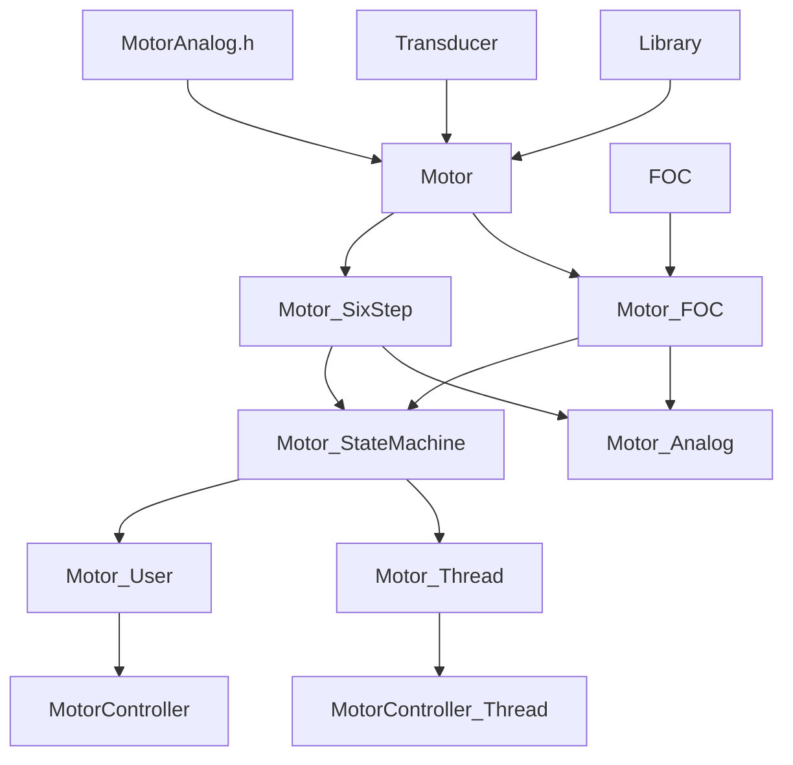
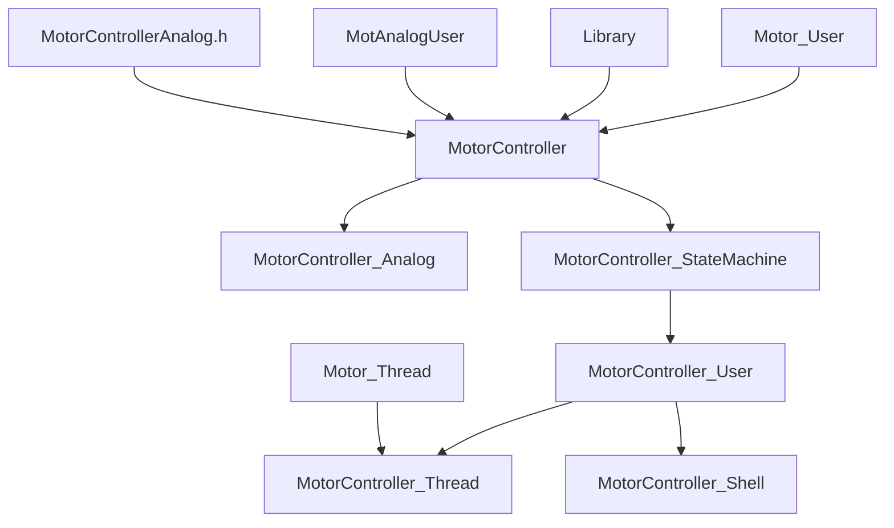

```mermaid
flowchart TB
    Library["Library"] --> Motor["Motor"]
    Transducer["Transducer"] --> Motor

    MotorAnalogH["MotorAnalog.h"] --> Motor
    Motor --> MotorFoc["Motor_FOC"]
    Motor --> MotorSixStep["Motor_SixStep"]
    MotorSixStep --> MotorAnalog["Motor_Analog"]
    Foc["FOC"] --> MotorFoc
    MotorFoc --> MotorAnalog
    MotorFoc --> MotorStateMachine["Motor_StateMachine"]
    MotorSixStep --> MotorStateMachine
    MotorStateMachine --> MotorThread["Motor_Thread"]
    MotorStateMachine --> MotorUser["Motor_User"]

    MotorUser --> MotorController["MotorController"]
    MotorThread --> MotorControllerThread["MotorController_Thread"]
```

```mermaid
flowchart TB
    MotorUser["Motor_User"] --> MotorController["MotorController"]
    MotorThread["Motor_Thread"] --> MotorControllerThread["MotorController_Thread"]
    Library["Library"] --> MotorController
    MotAnalogUser["MotAnalogUser"] --> MotorController
    MotorControllerAnalogH["MotorControllerAnalog.h"] --> MotorController
    MotorController --> MotorControllerStateMachine["MotorController_StateMachine"]
    MotorController --> MotorControllerAnalog["MotorController_Analog"]
    MotorControllerStateMachine --> MotorControllerUser["MotorController_User"]
    MotorControllerUser --> MotorControllerShell["MotorController_Shell"]
    MotorControllerUser --> MotorControllerThread
```