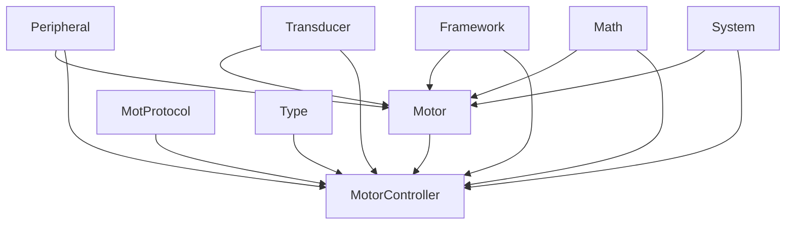
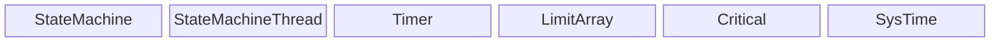
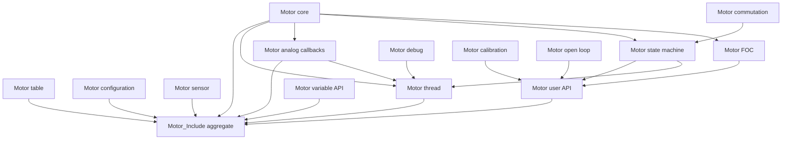
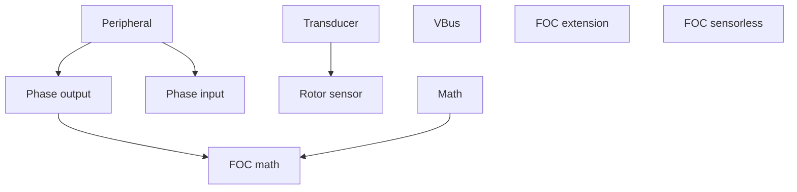
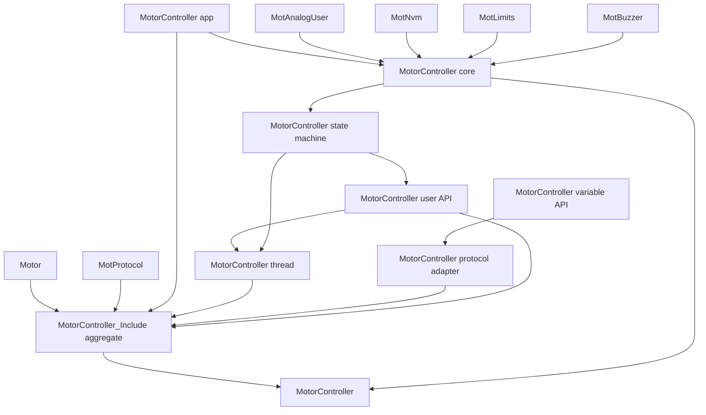

# Motor Dependency Graph

Arrows point from a dependency to its consumer. Each Mermaid fence renders independently. A diagram expands only its own group; dependencies outside that group appear as a single module node. Dotted connectors identify compile-time optional dependencies.

## Module Overview

### Framework And System

## Motor

### Motor Module

### Motor Control Domains

## MotorController

### MotorController Module

