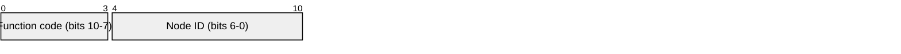
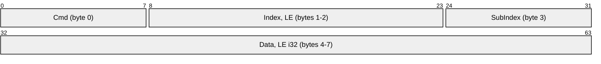
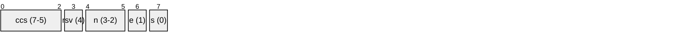

# MotCan — MotVar access over CANopen SDO

`MotorController_MotCan` exposes every `MotVarId` as a CANopen manufacturer-specific
object, reachable over the standard SDO server at `0x600 + nodeId`. Var read and write
are not COB-IDs of their own — they are the `ccs` field of an ordinary SDO request.

## Layering

The MotVar SDO server is kept separate from the CiA 402 profile server. It owns only
the `MotVarId` mapping and `MotorController_Var` access, and delegates all SDO framing,
`ccs` dispatch and abort encoding to the generic engine `Cia402_Sdo_HandleRequest` via
an OD callback interface.

| Layer | Symbols | Home |
|---|---|---|
| Wire format, pure | `MotCan_Od_IsVarIndex`, `MotCan_Od_ToVarId`, `MotCan_Od_IndexOf`, `MotCan_Od_SubIndexOf`, `MotCan_Od_GetInfo`, `MotCan_Od_Status` | `MotCan.h` |
| Context-bound callbacks | `MotCan_OdIf_GetInfo`, `MotCan_OdIf_Get`, `MotCan_OdIf_Set` | `MotorController_MotCan.h` |
| Server + range dispatch | `MotCan_HandleSdo`, `Req_HandleSdo` | `MotorController_MotCan.h` |

`Req_HandleSdo` splits one SDO address into two object ranges:

| Index range | Server |
|---|---|
| `0x2000`–`0x20FF` | MotVar accessors (this module) |
| everything else | `MotorController_Cia402_HandleSdo`, CiA 402 profile objects |

> `Motor_Cia402_HandleSdo` still carries its own copy of the ccs dispatch rather than
> calling the engine. Collapsing it onto the same entry point would leave exactly one
> SDO state machine in the tree.

## Object model

Every var is a 32-bit RW object. There is no per-id access table consulted up front —
read-only and state-refusals are reported by `MotorController_Var_Set`'s status, which
`MotCan_Od_Status` turns into the same abort code an access table would have produced.

`MotVarId_T` is already a namespaced struct accessor: `{Prefix, Type}` names the struct
type and `{Instance, Base}` names the member within it. That is precisely a CANopen
record, so the type pair becomes the object index and the member pair its subindex:

```
index    = 0x2000 | (Prefix << 4) | Type    ->  0x2000..0x20FF   (256 objects)
subindex = (Instance << 4) | Base           ->  0x00..0x3F       (64 members)
```

This is a bijection over all 16384 reachable ids (`Resv = 0`) and consumes only 256 of
the 16384 manufacturer indices (`0x2000`–`0x5FFF`).

> Subindex `0` is a real member here (Instance 0, Base 0), not the CiA 301 "number of
> entries" count — these are flat accessor records, not arrays.

## Wire shape

Expedited SDO, always 8 data bytes.

### COB-ID (11-bit standard)

| Direction | COB-ID |
|---|---|
| master → drive, request | `0x600 + nodeId` |
| drive → master, response | `0x580 + nodeId` |



The route matches the function code only (`ID_MASK 0x780`), so any nodeId in the low
7 bits is accepted and echoed back on the response.

### Payload — 8 bytes, CiA 301 expedited layout



### Byte 0 — Cmd (`Cia402_SdoCmd_T`)

Drawn MSB-first; the C bitfield declares these LSB-first, so the real bit numbers are
given in each label.



`ccs` = command code, `n` = unused data bytes, `e` = expedited, `s` = size indicated.

| Cmd | Meaning | Direction |
|---|---|---|
| `0x40` | upload init request (read) | master → drive |
| `0x23` | download init request (write, 4B) | master → drive |
| `0x43` | upload init response (read reply) | drive → master |
| `0x60` | download init response (write ack) | drive → master |
| `0x80` | abort | either direction |

### Bytes 1–3 — Index and SubIndex


`MotVarId_T` splits across the two wire fields:

- **Index** (bytes 1–2, LE) = `0x2000 | (Prefix << 4) | Type`
- **SubIndex** (byte 3) = `(Instance << 4) | Base`
- **Resv** must be 0; it is not carried on the wire.

### Bytes 4–7 — Data, little-endian

| Frame | Data field |
|---|---|
| read request | ignored (send zeros) |
| read response | `int32` value |
| write request | `int32` value |
| write ack | zeros |
| abort | `uint32` CiA 301 abort code (`Cia402_OdStatus_T`) |

## Worked example — VBus charge level, node 1

| Field | Symbol | Value |
|---|---|---|
| Prefix | `MOT_VAR_ID_PREFIX_V_MONITOR` | 5 |
| Type | `MOT_VAR_TYPE_VBUS_OUT` | 0 |
| Instance | — | 0 |
| Base | `VBUS_VAR_ID_CHARGE_LEVEL_FRACT16` | 2 |

→ index `0x2050`, subindex `0x02`

```
read  req   601  [8]  40  50 20  02  00 00 00 00
read  resp  581  [8]  43  50 20  02  <---- i32 LE ---->
```

This object is read-only, so a write is refused by `Var_Set` and the status becomes a
CiA 301 abort rather than an ack:

```
write req   601  [8]  23  50 20  02  <---- i32 LE ---->
abort resp  581  [8]  80  50 20  02  02 00 01 06
                                     ^^ 0x06010002 LE, "write to RO object"
```

## Engine behaviour worth knowing when writing a host

- On a write the engine decodes the data field per the object's OD type, ignoring the
  `e`/`n`/`s` bits. Every MotVar reports as `i32`, so all four data bytes are consumed —
  a host must send 4 data bytes (Cmd `0x23`), never a width-tagged short form such as
  `0x2F`.
- An abort from the master (Cmd `0x80`) is consumed with no reply.
- Segmented and block transfers are not supported; they abort `0x08000000`.
- An index or subindex outside the mapped range aborts `0x06020000`. An in-range id that
  no accessor backs is not detectable on read — it returns 0 rather than aborting
  (see `MotCan_OdIf_Get`).
