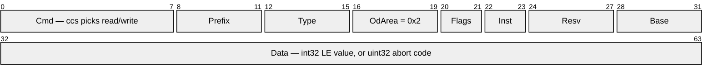
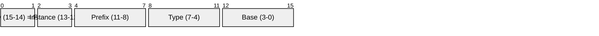

# MotCan — MotVar access over CANopen SDO

Every `MotVarId` is exposed as a CANopen manufacturer-specific object, reachable over
the standard SDO server at `0x600 + nodeId`. Var read and write are not COB-IDs of
their own — they are the `ccs` field of an ordinary SDO request.

This document has two halves, matching the two layers of the code:

- **Part 1 — the SDO/OD contract**: generic CiA 301, true of every object this drive
  serves. Implemented by `CANopen/OD.h` and `CANopen/SDO.h`.
- **Part 2 — the MotVar implementation**: how `MotVarId` occupies the manufacturer
  range. Implemented by `MotCan.h` and `MotorController_MotCan.h`.

---

# Part 1 — the SDO/OD contract

Nothing in this part is MotVar-specific. It is the contract the generic engine
`SDO_HandleRequest` implements, and it applies equally to the CiA 402 profile
objects served alongside.

## Object dictionary model

An object is addressed by a 16-bit **index** and an 8-bit **subindex**. For each
address the dictionary reports an `OD_Info_T`: data `Type`, `Access` (RO/WO/RW),
and `Size`. An address with `Type == OD_TYPE_NONE` does not exist.

The engine is generic over the dictionary — it reaches it through a
`OD_T` callback triple (`GetInfo` / `Get` / `Set`) supplied by the
integration layer, so it never knows what backs an object.

The table holds only functions and is `static const`. The object it acts on arrives
per call, as the engine's `p_context` argument, so one table serves every instance:

```c
SDO_HandleRequest(&od, p_context, p_req, p_rsp);
```

| Index range | CiA 301 meaning |
|---|---|
| `0x1000`–`0x1FFF` | communication profile |
| `0x2000`–`0x5FFF` | **manufacturer-specific** |
| `0x6000`–`0x9FFF` | standardized device profile (CiA 402 lives here) |

## COB-ID (11-bit standard)

| Direction | COB-ID |
|---|---|
| master to drive, request | `0x600 + nodeId` |
| drive to master, response | `0x580 + nodeId` |


## Frame — `SDO_T`, 8 bytes, expedited


Index and Data are little-endian within their byte spans.

### Byte 0 — Cmd (`SDO_Cmd_T`)

Drawn MSB-first; the C bitfield declares these LSB-first, so the real bit numbers are
given in each label.


`ccs` = command code, `n` = unused data bytes, `e` = expedited, `s` = size indicated.

| Cmd | Meaning | Direction |
|---|---|---|
| `0x40` | upload init request (read) | master to drive |
| `0x23` | download init request (write, 4B) | master to drive |
| `0x43` | upload init response (read reply) | drive to master |
| `0x60` | download init response (write ack) | drive to master |
| `0x80` | abort | either direction |

### Bytes 4–7 — Data

| Frame | Data field |
|---|---|
| read request | ignored (send zeros) |
| read response | value, width per the object's `Type` |
| write request | value, width per the object's `Type` |
| write ack | zeros |
| abort | `uint32` CiA 301 abort code (`OD_Status_T`) |

## Engine scope and limits

- Expedited transfers only. Segmented and block transfers abort `0x08000000`.
- On a write the engine decodes the data field per the object's `Type`, **ignoring the
  `e`/`n`/`s` bits**. The declared type, not the command byte, decides how many bytes
  are consumed.
- A nonexistent object aborts `0x06020000`; a nonzero subindex where none exists
  aborts `0x06090011`.
- Access is checked before dispatch: write to a declared-RO object aborts `0x06010002`,
  read of a declared-WO object aborts `0x06010001`.
- An abort from the master (Cmd `0x80`) is consumed with no reply. Every other request
  produces an 8-byte response.

---

# Part 2 — the MotVar implementation

## Mapping

A `MotVarId` is its index/subindex pair shifted by one nibble:

```
index    = 0x2000 | (MotVarId >> 4)     ->  0x2000..0x2FFF
subindex = MotVarId & 0xF               ->  Base
```

So `{Resv, Instance, Prefix, Type}` name the object and `Base` names the member within
it — each struct instance is its own object, the same way CiA 402 gives each axis its
own index page. The mapping is a bijection over all 65536 `MotVarId` values and depends
on nothing about `MotVarId_T`'s internal layout except that `Base` is the low nibble.

MotVar owns exactly one area nibble, `0x2`. Nibbles `0x3`–`0x5` of the manufacturer area
stay open, and route to the profile server, which reports them absent.

> Subindex `0` is a real member here (Base 0), not the CiA 301 "number of entries"
> count — these are flat accessor records, not arrays.

## The whole payload, with `MotVarId` in place

The generic frame from Part 1, with its address fields expanded into what MotVar
actually puts there. Bytes 1–2 are the index, little-endian, so the low byte comes first.



| Byte | `SDO_T` field | What MotVar puts there |
|---|---|---|
| 0 | `Cmd` | `ccs` only — read vs write. No MotVar content. |
| 1 | `Index` low | `(Prefix << 4) \| Type` |
| 2 | `Index` high | `(OdArea << 4) \| (Flags << 2) \| Instance`, OdArea always `0x2` |
| 3 | `SubIndex` | `(Resv << 4) \| Base`, Resv always zero |
| 4–7 | `Data` | the var's `int32` value, or a `uint32` abort code |

`MotCan_VarSdo_T` in `MotCan.h` is this diagram as a type: a union of the expanded
bitfield view above, as its `VarCmd` member, and the generic `SDO_T` view over
the same 8 bytes. It is packed at every level, because it is cast onto byte-aligned CAN
buffers and Cortex-M0+ faults on an unaligned word load.

Reassembled, the id is index bits 11–0 followed by subindex bits 3–0:



The overlay's `Flags` field is the same two bits as `MotVarId_T.Resv`.

## Admission

An address inside area `0x2` exists only if `Flags` and the subindex `Resv` nibble are
both zero. Neither has a meaning yet, so rather than silently alias onto the `Flags = 0`
var, such an address aborts `0x06020000` — a host that sets a flag the drive does not
implement is told so. That admits 16384 addresses, one per id with `Resv = 0`.

## Access model

Every var is a 32-bit RW object — `MotCan_Od_GetInfo` reports `I32` / `RW` / 4 for any
admitted address, with no per-id table.

Because access is not declared up front, the engine's RO check never fires for a MotVar
object. Read-only and state-refusals surface instead from `MotorController_Var_Set`'s
status, which `MotCan_Od_StatusOf` maps onto the same CiA 301 abort the engine would have
produced from a declared access mode:

| `MotVarId_Status_T` | Abort |
|---|---|
| `MOT_VAR_STATUS_OK` | none — write ack |
| `..._ERROR_INVALID_ID` | `0x06020000` no object |
| `..._ERROR_READ_ONLY` | `0x06010002` write to RO |
| `..._ERROR_WRITE_ONLY` | `0x06010001` read of WO |
| `..._ERROR_ACCESS_DISABLED` | `0x08000022` device state |
| `..._ERROR_NOT_CONFIG_STATE` | `0x08000022` device state |
| `..._ERROR_NOT_RUNNING_STATE` | `0x08000022` device state |
| other | `0x08000000` general |

## Worked example — VBus charge level, node 1

| Field | Symbol | Value |
|---|---|---|
| Prefix | `MOT_VAR_ID_PREFIX_V_MONITOR` | 5 |
| Type | `MOT_VAR_TYPE_VBUS_OUT` | 0 |
| Instance | — | 0 |
| Base | `VBUS_VAR_ID_CHARGE_LEVEL_FRACT16` | 2 |

Index `0x2050`, subindex `0x02`, so wire bytes 1–3 are `50 20 02`.

The same var on instance 1 (id `0x1502`) is a different object: index `0x2150`,
subindex `0x02`, wire bytes `50 21 02`.

```
read  req   601  [8]  40  50 20  02  00 00 00 00
read  resp  581  [8]  43  50 20  02  <---- i32 LE ---->
```

This object is read-only, so a write is refused by `MotorController_Var_Set` and the
status becomes a CiA 301 abort rather than an ack:

```
write req   601  [8]  23  50 20  02  <---- i32 LE ---->
abort resp  581  [8]  80  50 20  02  02 00 01 06
                                     ^^ 0x06010002 LE, "write to RO object"
```

## Notes for host authors

- Every MotVar reports as `i32`, so all four data bytes are consumed on a write. Send
  the 4-byte form (Cmd `0x23`), never a width-tagged short form such as `0x2F`.
- An in-range id that no accessor backs is not detectable on read:
  `MotorController_Var_Get` has no status channel, so it returns 0 rather than
  aborting (see `_MotCan_OdGet`). Writes to such an id do report `0x06020000`.

---

# Code map

| Layer | Symbols | Home |
|---|---|---|
| Generic SDO engine, OD interface | `SDO_HandleRequest`, `OD_T` | `CANopen/SDO.h`, `CANopen/OD.h` |
| Frame, abort codes, index view | `SDO_T`, `OD_Status_T`, `OD_Index_T`, `OD_Area_Of` | `CANopen/SDO.h`, `CANopen/OD.h` |
| MotVar mapping, pure wire format | `MotCan_Od_IsVarIndex`, `MotCan_Od_ToVarId`, `MotCan_Od_IndexOf`, `MotCan_Od_SubIndexOf`, `MotCan_Od_GetInfo`, `MotCan_Od_StatusOf`, `MotCan_VarSdo_T`, `MotCan_VarSdo_IsVarId`, `MotCan_VarSdo_VarId` | `MotCan.h` |
| MotVar OD callbacks, context-bound | `_MotCan_OdGetInfo`, `_MotCan_OdGet`, `_MotCan_OdSet` | `MotorController_MotCan.h` |
| Server and range dispatch | `MotCan_HandleSdo`, `Req_HandleSdo` | `MotorController_MotCan.h` |

`MOTOR_CONTROLLER_MOT_CAN_SERVICE` consumes CANopen COB-ID classes only — every route
matches the function code (`COB_FUNCTION_MASK`), for any node:

| COB-ID class | Handler |
|---|---|
| RxPDO1 `0x200`, RxPDO2 `0x300` | `MotorController_Cia402_HandleRxPdo` — one handler; each channel's mapping (`0x1600+n`) sets the layout |
| SDO request `0x600` | `Req_HandleSdo` — split by index range, below |

`Req_HandleSdo` splits one SDO address into two object ranges:

| Index range | Server |
|---|---|
| `0x2000`–`0x2FFF` | MotVar accessors (this module) |
| everything else | `MotorController_Cia402_HandleSdo` — PDO parameters (RPDO `0x1400+n`/`0x1600+n`, TPDO `0x1800+n`/`0x1A00+n`) and CiA 402 profile objects |

> `Motor_Cia402_HandleSdo` still carries its own copy of the ccs dispatch rather than
> calling the engine. Collapsing it onto the same entry point would leave exactly one
> SDO state machine in the tree.
