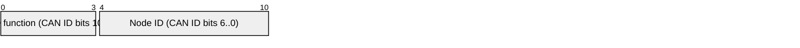
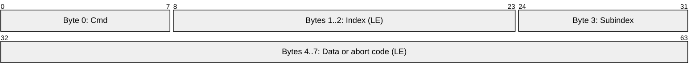

# MotVar SDO Packet

MotVar objects use expedited CiA 301 SDO frames in the CANopen
manufacturer-specific object range, `0x2000..0x20FF`. Each object is a signed
32-bit value; the CAN payload is always eight bytes.

## COB-ID

Display position 0 is the most-significant bit of the standard 11-bit CAN
identifier.

| Direction | Function | COB-ID |
| --- | --- | --- |
| Master to drive | `0x600` | `0x600 + nodeId` |
| Drive to master | `0x580` | `0x580 + nodeId` |

## SDO Payload

Bit positions follow wire order, with byte 0 at the left. Multi-byte fields
are little-endian.

| Operation | Request command | Response command | Bytes 4..7 |
| --- | --- | --- | --- |
| Read | `0x40` | `0x43` | Signed 32-bit value in response |
| Write | `0x23` | `0x60` | Signed 32-bit value in request; zeros in acknowledgement |
| Abort | `0x80` | `0x80` | CiA 301 abort code |

## MotVar Object Address

The index and subindex reconstruct a `MotVarId_T` accessor. The diagram lays
out the index byte pair followed by the subindex byte, each most-significant
bit first.

`index = 0x2000 | (Prefix << 4) | Type` and
`subindex = (Instance << 4) | Base`.

For example, VBus charge level (`Prefix = 5`, `Type = 0`, `Instance = 0`,
`Base = 2`) maps to index `0x2050`, subindex `0x02`.