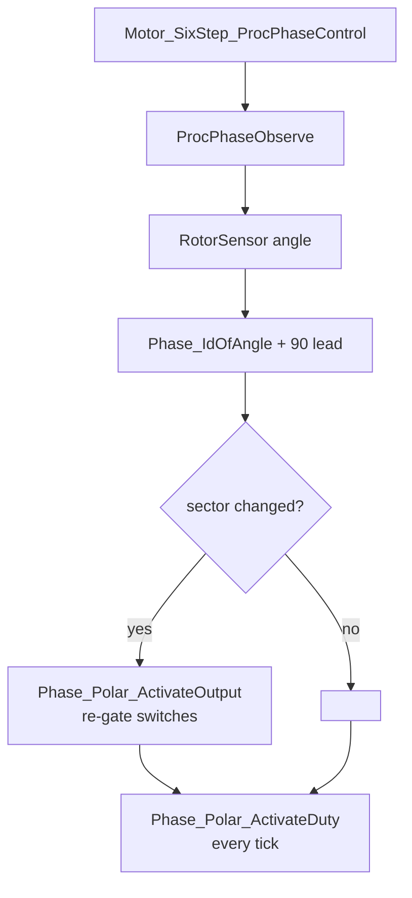

# Six-Step Salvage Record

`Motor_Context_T` still reserves the six-step block under `MOTOR_SIX_STEP_ENABLE`
([Motor.h:347-360](../Motor.h#L347)), and nothing currently writes it.

## Per-tick flow

Gate reconfiguration is a per-commutation event — in bipolar mode it needs
`Phase_Deactivate` plus polarity inversion first. Duty is per PWM tick. That split
is the whole reason `Phase_Polar` exposes `ActivateOutput` and `ActivateDuty`
separately, and it is the one structural idea worth carrying forward.

