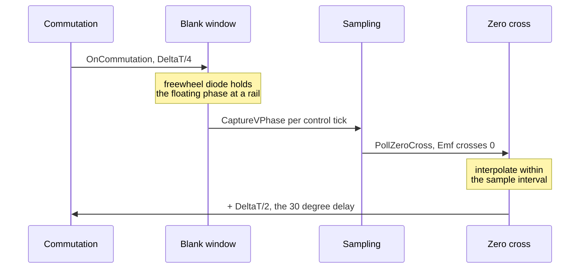

# VBemf Salvage Record

## Commutation cycle

```mermaid
sequenceDiagram
    participant C as Commutation
    participant B as Blank window
    participant S as Sampling
    participant Z as Zero cross
    C->>B: OnCommutation, DeltaT/4
    Note over B: freewheel diode holds<br/>the floating phase at a rail
    B->>S: CaptureVPhase per control tick
    S->>Z: PollZeroCross, Emf crosses 0
    Note over Z: interpolate within<br/>the sample interval
    Z->>C: + DeltaT/2, the 30 degree delay
```
