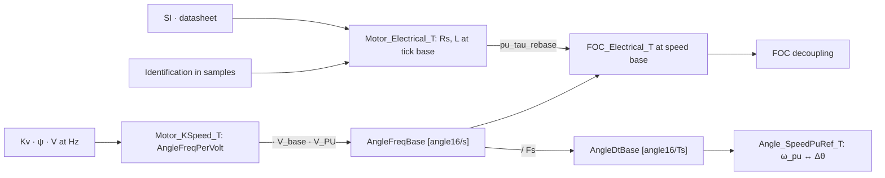

# Per-unit speed bases

ψ_pu and L_pu are per-unit at a speed base. The base is a frequency in angle16/s ([angle_freq_t], Hz Q16), so one equation covers every base:

    x_pu = x · ω_base / Z_base,    ω_base = F_base · π / 2^15 [rad/s]

    ψ_pu = ψ · F_base · π / V_base              MOTOR_PSI_PU, psi_pu_of_wb
    L_pu = L · I_base · F_base · π / V_base     MOTOR_L_PU,   l_pu_of_h

Units cancel: ψ [V·s/rad] · F [angle16/s] · π [rad per 2^15 angle16] / V_base [V] is dimensionless. The remaining 2^15 is the Q15 scale. `FRACT16_PI` (π · 2^15) carries both, which is why it appears in every integer form.

## Two complementary bases

| Base | F_base | ω_pu | Holds |
|---|---|---|---|
| Tick | `angle_freq_nyquist(Fs)` = Fs · 2^15, ω_base = π · Fs | Δθ [angle16/Ts], 32768 = π rad/Ts | L and Rs storage and identification. Measurements are in samples, and Nyquist is the largest usable base, so every other base is a scale-down |
| Speed base | `Motor_KSpeed_AngleFreqBase` = AngleFreqPerVolt · V_base · `MOTOR_SPEED_BASE_V_PU` | `Speed_Pu` | Speed loop, limits, UI, FOC decoupling. ψ_pu = `MOTOR_SPEED_BASE_V_PU` by definition |

ψ_tick is v_pu per [angle16/Ts]. The tick is in the numerator (time on top), so the name is `PU_TICK`, per-unit on the tick base, not `PER_TICK`.

## Routing

Speed units enter only through `angle_freq_of_rpm`, `angle_freq_of_rads` and `ANGLE_FREQ(Hz)`. Callers compose the base and call the core; the rpm and rad/s variants are commented out. The tick forms (`*_pu_tick_of_*`) are written directly against Fs. They equal the core at `angle_freq_nyquist(Fs)`, where F / 2^15 = Fs exactly. Against the previous direct forms (V_base 24–150 V, base 16–990 Hz, ψ 0.4–120 mWb, L 5–5000 µH, values ≤ 4 pu), rpm and rad/s bases through the core are within 1 LSB in ≤ 0.2% of cases, where F_base / 2^15 is not whole.

The core divides by a Q15 constant first and by the variable divisor last, so one truncation is in effect:

    ψ_pu = ψ · F / 2^15 · FRACT16_PI / (V_base · scale)     F / 2^15 is exact at the tick base and whole-Hz bases
    ψ    = ψ_pu · V_base · scale / FRACT16_PI · 2^15 / F
    L_pu = L · I_base · F / 2^15 · FRACT16_PI / (V_base · scale)
    L    = L_pu · V_base · scale / FRACT16_PI · 2^15 / (I_base · F)

A single division overflows 64 bits for L at the tick base (L · I_base · F · `FRACT16_PI` exceeds 2^64 above ~440 µH at 625 A). Dividing by `scale` first is off by 1 LSB in 3–11% of cases. The L forms are the ψ forms with ψ = L · I_base, written out so L · I_base is a 64-bit product (as a 32-bit ψ argument it wraps above 4.29e9, e.g. 10 mH in nH at 625 A).

`pu_tau_rebase(x, from, to) = x · to / from` moves ψ_pu or L_pu between bases. It applies only to quantities with time on top (ψ in V·s, L · I_base in V·s); a speed in pu of the base scales inversely, and Rs, V, I do not change. Tick to speed base is a scale-down, so no bits are lost beyond the output's.

### Open: round-trip rounding

Every conversion truncates, so a value that goes up and back down loses 1 LSB:

- Speed base → tick → speed base through `pu_tau_rebase` (and the commented `l_pu_tick_of_pu*` / `l_pu_of_pu_tick` wrappers) returns x − 1 unless the base ratio is whole. 200 Hz at Fs 20 kHz is exactly 50 and round-trips; across five other bases only 396 of 1,880 values came back unchanged. Scaling up to the midpoint of the interval x stands for, `(2x + 1) · to / (2 · from)`, returned all 1,880.
- SI → pu → SI reads 80 µH back as 79, at tick and at rpm bases, for the same reason.

`Motor_KSpeed_TickOfPu` scales up to the midpoint, so the var write path (FOC view → tick store → FOC view) returns every value written: 69,060 of 69,060 at bases up to Nyquist / 2, where the tick sum in `Motor_Electrical_OfLdq` fits uint32. Tick → speed base paths (`Motor_Electrical_FocOf`) truncate once. A base change re-derives from the tick store, so a Kv change and back no longer drifts L.

## Speed base

[Motor_KSpeed_T] stores the speed constant, a BEMF speed per volt: `AngleFreqPerVolt` [angle16/s per V, electrical, phase peak], 1 / ψ. It holds no rpm, rad/s, or board base. The speed base is derived, a multiply:

    F_base = AngleFreqPerVolt · V_base · MOTOR_SPEED_BASE_V_PU / 2^15        Motor_KSpeed_AngleFreqBase

`MOTOR_SPEED_BASE_V_PU` is the speed-scaling choice, not motor data: ω_pu = 1.0 where the BEMF reaches that fraction of V_base, and ψ_pu at the speed base equals it. It is 0.5, so these hold with shifts only, and a static_assert holds them to it: VSpeed = ω_pu / 2, no-field-weakening ceiling = VBus_pu, rated = VNominal_pu.

Kv and rpm are views at the user boundary (`Motor_Config_GetKv` / `SetKv`, the rpm conversions). Entry forms convert to the rate:

| Entry | Compile time | Runtime | View |
|---|---|---|---|
| Kv, M = 2 | `MOTOR_K_SPEED_OF_KV`, `MOTOR_ANGLE_FREQ_PER_V_OF_KV` | `angle_freq_per_v_of_kv` | `kv_of_angle_freq_per_v`, rounds |
| ψ | `MOTOR_ANGLE_FREQ_OF_PSI(1, ψ)` | `angle_freq_per_v_of_psi` | `psi_wb_of_angle_freq_per_v` |
| V_emf at Hz | `MOTOR_ANGLE_FREQ_OF_V_HZ(1, V_emf, Hz)` | | |

Example: Kv 150 with 4 pole pairs is 20 Hz/V = 1,310,720 angle16/s per V, so 940 Hz electrical, 14100 rpm at V_base 94 V. The compile-time Kv macro computes in double and equals the runtime adapter for every integer Kv (30,000 of 30,000, Kv 1–1000, P 1–30), and keeps a fractional Kv: 8.4 at 23 pp gives 422,051 (exact 422,051.8).

The rate is electrical. `Motor_Config_SetPolePairs` sets the pole pairs only, so it holds ψ and moves the Kv view. Kv written after the pole pairs, in var id order, holds Kv.

One base, three encodings: `Motor_KSpeed_AngleFreqBase` [angle16/s], `Motor_KSpeed_AngleDtBase` = AngleFreqBase / Fs [angle16/Ts], `Motor_KSpeed_SpeedBase_Rpm` [mechanical].

## Storage and the FOC view

| Struct | Holds | Base | Persisted |
|---|---|---|---|
| `Motor_Config_T.KSpeed` [Motor_KSpeed_T] | PolePairs, AngleFreqPerVolt | none | yes |
| `Motor_Config_T.Electrical` [Motor_Electrical_T] | Rs, Ls, Ldelta | tick | yes |
| `FOC_T.Electrical` [FOC_Electrical_T] | Ld, Lq, Rs, ψ | speed | no, derived |
| `FOC_Config_T` | field weakening | | yes |

`Motor_ResolveFocParams` derives the FOC view (`Motor_Electrical_FocOf`) on `Motor_Reset` and after the calibration commit. ψ is not stored: at the speed base it is `MOTOR_SPEED_BASE_V_PU`, and [Motor_KSpeed_T] is the one copy of the motor constant.

The `FOC_CONFIG_ELECTRICAL_*` var ids stay on the wire at the speed base, as the app decodes them. A write goes to the FOC view and the tick store follows (`Motor_Electrical_OfFoc`). The view keeps each axis as written, so Ld written above the old Lq, then Lq, lands both, while the store applies the Lq ≥ Ld clamp in between. ψ is read-only there, set by [Motor_KSpeed_T].

Sensors receive the base as `AngleFreqBase` in [RotorSensor_UnitRef_T] and derive [Angle_SpeedPuRef_T] at their polling freq. Pulse counters scale against the base in their own revolution. The Hall counter is mechanical: AngleFreqBase / PolePairs over 6 · PolePairs counts.

`Angle_SpeedPuRef_T` holds AngleDtBase and its inverse. `Angle_ResolveSpeed_Pu` clamps |Δθ| ≤ AngleDtBase to keep Inv · Δθ within int32, so the resolved speed saturates at ±1.0 pu.

## Kv convention

    Ke_mech = 60 / (2π · Kv)                     [V·s/rad mech]
    ψ_f     = Ke_mech / (P · M)                  [Wb, phase peak]
    ψ_pu    = ω_base_rpm / (M · Kv · V_base)     60/(2π·P) cancels

- M = 2: Kv observed at bus voltage, phase-peak BEMF = V/2 at Kv · V. Used by `*_of_kv`. ψ_pu = 0.5 at Kv · V_base.
- M = √3: line-to-line rating. `psi_pu_of_ke`.

    Kt_FOC = (3/2) · P · ψ_f = 45 / (π · Kv · M)     [Nm/A, peak iq, P cancels]
    Kt_mtr = 60 / (2π · Kv) = Ke_mech                [Nm/A_rms]

Vendor bases to internal phase peak: Kv_phase = √3 · Kv_LL_pk, Kv_pk = Kv_rms / √2.

ψ_pu > 1.0 when rpm_max / (Kv · M) > V_base (field-weakening region). ψ_pu < 1.0 when the motor reaches its mechanical limit before voltage saturation.

# Reference

## Bases

V_base, I_base, and ω_base are the anchors. A per-unit value exceeds 1.0 when the quantity exceeds its base.

| Base | Definition | Tick base, ω_base = π · Fs | Relation |
|---|---|---|---|
| V_base [V] | `Phase_VMaxVolts` | | |
| I_base [A] | `Phase_IMaxAmps` | | |
| ω_base [rad/s, electrical] | F_base · π / 2^15 | π · Fs | |
| R_base [Ω] | V_base / I_base | | v = R · i |
| ψ_base [Wb] | V_base / ω_base | V_base / (π · Fs) | v = ω · ψ |
| L_base [H] | ψ_base / I_base = V_base / (ω_base · I_base) | V_base / (π · Fs · I_base) | v = ω · L · i |
| τ_base [s] | 1 / ω_base = L_base / R_base | Ts / π | τ = L / R |
| T_base [N·m] | (3/2) · P · ψ_base · I_base | | |
| P_base [W] | (3/2) · V_base · I_base | | |

## Per-unit quantities

All Q15, 32768 = 1.0. ψ_pu, L_pu, and Rs_pu are accum32 and may exceed 1.0.

| Quantity | Per-unit | From a measurement | Code |
|---|---|---|---|
| ω | ω / ω_base | | `Speed_Pu` |
| Rs | Rs · I_base / V_base | v_pu / i_pu | `MOTOR_R_PU`, `rs_pu_of_ohm`, `rs_pu_of_vi` |
| ψ | ψ · ω_base / V_base | v_emf_pu / ω_pu | `MOTOR_PSI_PU`, `psi_pu_of_wb`, `psi_pu_of_emf` |
| L | L · ω_base · I_base / V_base | v_L_pu / (ω_pu · i_pu) | `MOTOR_L_PU`, `l_pu_of_h`, `l_pu_tick_of_*` |

ψ_pu and L_pu scale with ω_base, Rs_pu does not. Between bases: x_b = x_a · ω_b / ω_a (`pu_tau_rebase`), e.g. x_tick = x_pu · π · Fs / ω_base.

- ψ_pu = 1.0: the BEMF reaches V_base at ω_base. At the [Motor_KSpeed_T] base, ψ_pu = `MOTOR_SPEED_BASE_V_PU`.
- L_pu < 1.0: L < L_base.

## Voltage terms

| Term | Per-unit | SI / V_base |
|---|---|---|
| Resistive | Rs_pu · i_pu | Rs · i |
| BEMF | ω_pu · ψ_pu | ω · ψ |
| Inductive coefficient | ω_pu · L_pu | ω · L · I_base |
| Cross-coupling | ω_pu · L_pu · i_pu | ω · L · i |

## Speed encodings

Canonical: electrical angle16/s. rpm and rad/s are views at the boundary. Mechanical = electrical / P.

Angle: angle16, 65536 per turn, 32768 = π rad. `ANGLE16_PER_RADIAN` = 2^15 / π = 10430.

| Encoding | Type | Unit | At ω_base | From ω [rad/s] |
|---|---|---|---|---|
| Frequency | [angle_freq_t] | angle16/s, Hz in Q16 | `Motor_KSpeed_AngleFreqBase` | F = ω · 2^15 / π = f · 65536 = erpm · 65536 / 60 |
| Step | `angle_dt_t` | angle16/Ts | `Motor_KSpeed_AngleDtBase` | Δθ = F / Fs |
| Per-unit | Q15 | ω_base | 32768 | ω_pu = Δθ · 2^15 / Δθ_base |
| Mechanical rpm | | rpm | `Motor_KSpeed_SpeedBase_Rpm` | rpm = F · 60 / (65536 · P) |

| Unit | To [angle_freq_t] | From [angle_freq_t] |
|---|---|---|
| Hz | `ANGLE_FREQ`, `angle_freq` | `angle_freq_to_hz` |
| erpm | `ANGLE_FREQ_OF_RPM`, `angle_freq_of_rpm` | `rpm_of_angle_freq` |
| rad/s, scaled | `ANGLE_FREQ_OF_RADS`, `angle_freq_of_rads` | `rads_of_angle_freq` |
| angle16/Ts | `angle_freq_of_angle_dt` | `ANGLE_DT_OF_FREQ`, `angle_dt_of_angle_freq` |
| Mechanical rpm | | `mech_rpm_of_el_angle_freq`, rounds |
| Tick base | `ANGLE_FREQ_NYQUIST`, `angle_freq_nyquist` = Fs · 2^15 | |

## Integrator

    θ[k+1] = θ[k] + Δθ,    Δθ_base = F_base / Fs = ω_base · 2^15 / (π · Fs)

| Base | ω_pu → Δθ | Δθ → ω_pu |
|---|---|---|
| Speed base | Δθ = ω_pu · Δθ_base / 2^15, `Angle_CaptureSpeed_Pu` | ω_pu = (Δθ · Inv) >> 16, Inv = INT32_MAX / Δθ_base, `Angle_ResolveSpeed_Pu` |
| Tick base | Δθ = ω_pu | ω_pu = Δθ |

## Tick base at Fs = 20 kHz

Fixed by Fs, independent of the motor.

| | Formula | Fs = 20 kHz |
|---|---|---|
| ω_base | π · Fs | 62832 rad/s, 10 kHz, 600000 erpm |
| Δθ_base | 2^15, π rad per Ts | 32768 |
| 1 LSB | π · Fs / 2^15 rad/s | 1.92 rad/s, 0.305 Hz, 18.3 erpm |
| ψ_base | V_base / (π · Fs) | 1.50 mWb at 94 V |
| L_base | V_base / (π · Fs · I_base) | 2.49 µH at 94 V, 600 A |

- Δθ is int16 and wraps at ±π, so the tick base is Nyquist by construction.
- Running speeds use 2–25% of the range, [0:8192]. 1000 rpm at 4 pole pairs is 419 rad/s, 218 LSB. A speed base resolves k = π · Fs / ω_base times finer, so the tick base holds storage and identification, and the speed loop runs at the speed base.
- ω_base = π · Fs / k with k a power of two gains log2(k) bits and bounds Δθ to π / k per Ts.

# Worked example

ω · L · I_base / V_base at three encodings.

L = 80 µH, V_base = 94 V, I_base = 600 A, Fs = 20 kHz, 4 pole pairs. Speed base 5000 rpm = 20000 erpm = 2094.4 rad/s: F_base = 21,845,333, Δθ_base = 1092, k = 30.

## Bases by k

ω_base = π · Fs / k. The tick base is k = 1.

| k | Δθ_base | f_base [Hz] | erpm | rpm, 4 pp | rpm, 8 pp | L_base [µH] | ψ_base [mWb] |
|---:|---:|---:|---:|---:|---:|---:|---:|
| 1 | 32768 | 10000 | 600000 | 150000 | 75000 | 2.49 | 1.50 |
| 2 | 16384 | 5000 | 300000 | 75000 | 37500 | 4.99 | 2.99 |
| 4 | 8192 | 2500 | 150000 | 37500 | 18750 | 9.97 | 5.98 |
| 8 | 4096 | 1250 | 75000 | 18750 | 9375 | 19.9 | 12.0 |
| 16 | 2048 | 625 | 37500 | 9375 | 4688 | 39.9 | 23.9 |
| 32 | 1024 | 312.5 | 18750 | 4688 | 2344 | 79.8 | 47.9 |
| 64 | 512 | 156.3 | 9375 | 2344 | 1172 | 159.6 | 95.7 |
| 128 | 256 | 78.1 | 4688 | 1172 | 586 | 319.2 | 191.5 |

A power-of-two k is a shift, so ψ and L could be stored as (factor, shift): x_pu = x_q15 · 2^n, n = log2(k), x_q15 = x · π · Fs / (Z_base · k) · 2^15, Z_base = V_base for ψ and V_base / I_base for L. Tick storage keeps the Q15 scale in 32 bits instead.

## L at each encoding

| Encoding | Base | Value |
|---|---|---|
| Direct, no Q15 | tick | L_du = 32, 32.084 truncated |
| Q15, stored | tick | L_tick = 1,051,339 = 32.084 · 2^15, `MOTOR_L_PU_TICK` |
| Q15 | speed base | L_pu = 35,045 = 1.0695 · 2^15, `l_pu_of_h`. `pu_tau_rebase(L_tick)` gives 35,044 |

## Product across speed

Exact = ω_e · L · I_base / V_base · 2^15. Speeds rounded to nearest, products truncated. ω_pu ≥ 32768 is ≥ 1.0 pu, in accum32 range.

| rpm | ω_e [rad/s] | Δθ | ω_pu | Direct, Δθ · L_du | Tick, Δθ · L_tick >> 15 | Speed base, ω_pu · L_pu >> 15 | Exact |
|---:|---:|---:|---:|---:|---:|---:|---:|
| 100 | 42 | 22 | 655 | 704 (+0.44%) | 705 (+0.59%) | 700 (−0.13%) | 701 |
| 500 | 209 | 109 | 3277 | 3488 (−0.47%) | 3497 (−0.21%) | 3504 (−0.01%) | 3504 |
| 1000 | 419 | 218 | 6554 | 6976 (−0.47%) | 6994 (−0.21%) | 7009 (0.00%) | 7009 |
| 2000 | 838 | 437 | 13107 | 13984 (−0.24%) | 14020 (+0.02%) | 14017 (−0.01%) | 14018 |
| 5000 | 2094 | 1092 | 32768 | 34944 (−0.29%) | 35036 (−0.02%) | 35045 (0.00%) | 35045 |
| 7500 | 3142 | 1638 | 49152 | 52416 (−0.29%) | 52554 (−0.02%) | 52567 (0.00%) | 52567 |
| 10000 | 4189 | 2185 | 65536 | 69920 (−0.24%) | 70104 (+0.02%) | 70090 (0.00%) | 70089 |

- Direct multiply needs no Q15 shift and no 64-bit intermediate. Only the composite V terms, ω_pu · L_pu · i_pu, store above 1.0 pu. L_du drops the fraction, −0.26% on its own, and Δθ adds its quantization.
- Tick Q15 removes the L truncation. Δθ quantization remains, up to 0.6% at 100 rpm.
- At the speed base ω_pu resolves 30× finer than Δθ and stays within 0.13% across the range. This is the runtime form.

## Representation

    ω_pu, θ             fract16, Q15 / Q16, identity scale to the angle wrap
    ψ_pu, L_pu, Rs_pu   accum32

A wide multiply keeps full precision without the Q15 shift: ω in Q16.16 · L_pu in Q16.15, angle32_t · accum32_t → accum32_t, angle16_t · accum32_t → accum32_t.
