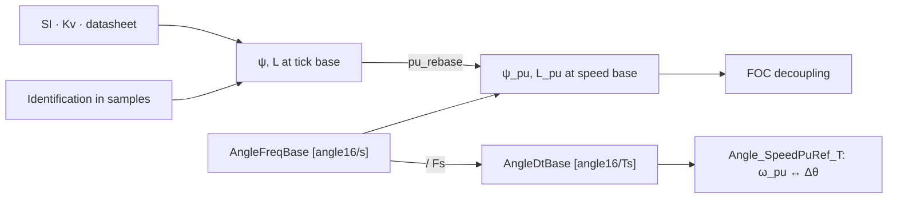

# Per-unit speed bases

ψ_pu and L_pu are per-unit at a speed base. The base is a frequency in angle16/s ([angle_freq_t], Hz Q16), so one equation covers every base:

    x_pu = x · ω_base / Z_base,    ω_base = F_base · π / 2^15 [rad/s]

    ψ_pu = ψ · F_base · π / V_base              MOTOR_PSI_PU, psi_pu_of_wb
    L_pu = L · I_base · F_base · π / V_base     MOTOR_L_PU,   l_pu_of_h = psi_pu_of_wb(L · I_base)

Units cancel: ψ [V·s/rad] · F [angle16/s] · π [rad per 2^15 angle16] / V_base [V] is dimensionless. The remaining 2^15 is the Q15 scale. `FRACT16_PI` (π · 2^15) carries both, which is why it appears in every integer form.

## Two complementary bases

| Base | F_base | ω_pu | Holds |
|---|---|---|---|
| Tick | `angle_freq_nyquist(Fs)` = Fs · 2^15, ω_base = π · Fs | Δθ [angle16/Ts], 32768 = π rad/Ts | ψ and L storage and identification. Measurements are in samples, and Nyquist is the largest usable base, so every other base is a scale-down |
| Speed base | `AngleFreqBase` | `Speed_Fract16` | Speed loop, limits, UI, FOC decoupling |

ψ_tick is v_pu per [angle16/Ts]. The tick is in the numerator (time on top), so the name is `PU_TICK`, per-unit on the tick base, not `PER_TICK`.

## Routing

The rad/s, rpm, and tick forms call one core, taking the base from `angle_freq_of_rads`, `angle_freq_of_rpm`, or `angle_freq_nyquist`. Against the previous direct forms (V_base 24–150 V, base 16–990 Hz, ψ 0.4–120 mWb, L 5–5000 µH, values ≤ 4 pu), the tick forms are bit-exact, and the rpm and rad/s forms are within 1 LSB in ≤ 0.2% of cases, where F_base / 2^15 is not whole. The `scale` of the rad/s forms is the ψ or L unit only. The mrad/s forms pass their ω scale to `angle_freq_of_rads`.

The core divides by a Q15 constant first and by the variable divisor last, so one truncation is in effect:

    ψ_pu = ψ · F / 2^15 · FRACT16_PI / (V_base · scale)     F / 2^15 is exact at the tick base and whole-Hz bases
    ψ    = ψ_pu · V_base · scale / FRACT16_PI · 2^15 / F

A single division overflows 64 bits for L at the tick base (L · I_base · F · `FRACT16_PI` exceeds 2^64 above ~440 µH at 625 A). Dividing by `scale` first is off by 1 LSB in 3–11% of cases. `l_h_of_pu` is `psi_wb_of_pu / I_base`, equal to the direct form, since nested floor divisions equal one division by the product.

`pu_rebase(x, from, to) = x · to / from` moves ψ_pu or L_pu between bases. Tick to speed base is a scale-down, so no bits are lost beyond the output's.

## Speed base

`speed_base_of_v_pu(Fs, ψ_tick, v_pu)` is the base at which ψ_pu = v_pu. Compile-time forms: `MOTOR_SPEED_BASE_OF_PSI` (ω_base = v_pu · V_base / ψ) and `MOTOR_SPEED_BASE_OF_V_HZ` (from a V_emf at Hz rating). Example: 15.92 mWb, V_base 94 V, v_pu 0.5 → 470 Hz electrical.

At v_pu = 0.5 of V_base the base reproduces Kv · V_max for a Kv-derived ψ, and these hold exactly: VSpeed = ω_pu / 2, no-field-weakening ceiling = VBus_pu, rated = VNominal_pu.

One base, three encodings: `AngleFreqBase` [angle16/s], `AngleDtBase` = AngleFreqBase / Fs [angle16/Ts], `SpeedBase_Rpm` [mechanical].

`Angle_SpeedPuRef_T` holds AngleDtBase and its inverse. `Angle_ResolveSpeed_Fract16` clamps |Δθ| ≤ AngleDtBase to keep Inv · Δθ within int32, so the resolved speed saturates at ±1.0 pu.

## Kv convention

    Ke_mech = 60 / (2π · Kv)                     [V·s/rad mech]
    ψ_f     = Ke_mech / (P · M)                  [Wb, phase peak]
    ψ_pu    = ω_base_rpm / (M · Kv · V_base)     60/(2π·P) cancels

- M = 2: Kv observed at bus voltage, phase-peak BEMF = V/2 at Kv · V. Used by `*_of_kv`. ψ_pu = 0.5 at Kv · V_base.
- M = √3: line-to-line rating. `psi_pu_of_ke`.

    Kt_FOC = (3/2) · P · ψ_f = 45 / (π · Kv · M)     [Nm/A, peak iq, P cancels]
    Kt_mtr = 60 / (2π · Kv) = Ke_mech                [Nm/A_rms]

Vendor bases to internal phase peak: Kv_phase = √3 · Kv_LL_pk, Kv_pk = Kv_rms / √2.

ψ_pu > 1.0 when rpm_max / (Kv · M) > V_base (field-weakening region). ψ_pu < 1.0 when the motor reaches its mechanical limit before voltage saturation.

/*
    base in SI
    Anchor for PU of 1.0 (PU exceeds 1.0 when value exceeds base)
    V_base [V]
    I_base [A]
    ω_base [rad/s electrical]

    Derived (PU conditionally > 1.0):
    R_base [Ω]   = V_base / I_base
    τ_base [s]   = 1 / ω_base = L_base / R_base,    for time constants τ = L/R
    ψ_base [Wb]  = V_base / ω_base,  [v = ω·ψ]
    L_base [H]   = ψ_base / I_base = V_base / (ω_base · I_base),  [v = L·di/dt = ω·L·I]
    T_base [N·m] = (3/2) · p · ψ_base · I_base
    P_base [W]   = (3/2) · V_base · I_base

    integrator:
    Δθ = ω_pu · (ω_base / Fs)
    θ[k+1] = θ[k] + ω_pu · ω_base / Fs

    ω_base, ψ_base, τ_base:
    ω_base from ω in Fs:
    dt [s] = 1 / Fs
    Fs [Hz] = 1 / dt
    ω [n/dt] = ω [rad/s] / (2π · Fs)

    Δθ_base = ω_base · 65536/(2π·Fs)
    Δθ = ω_pu · Δθ_base = ω_pu · ω_base / (π · Fs)
    ω_pu = Δθ · π · Fs / ω_base

    ψ_pu_tick = ψ_pu_tau / (ω_base / (π · Fs))

    Per-unit:
    Rs_pu = Rs · I_base / V_base

    ψ and L are dependent on ω_base:
    ψ == v_emf / ω:
    ψ_pu = ψ · ω_base / V_base
    ψ_pu = (v_emf / ω) · (ω_base / V_base) = (v_emf / V_base) / (ω / ω_base)

    L == v_L / (ω · I):
    L_pu = L · I_base / ψ_base = L · ω_base · I_base / V_base
    L_pu = (v_L / (ω · I)) · (ω_base · I_base / V_base)

    v_emf_pu terms:
    ω_pu·ψ_pu = ω · ψ / V_base = (ω/ω_base) · (ψ · ω_base / V_base)
    ω_pu·L_pu = ω · L · I_base / V_base
    ω_pu·L_pu·I_pu = ω · L · I / V_base

    ψ_pu = 1.0, when V_base, ω_base are self-consistent, per motor, V_base = Kv · ω_base [rpm]
    L_pu < 1.0, when L < V_base / I_base
*/
/*
    Angle16/Fs:
    ω_base [rad/s] = π · Fs
    ω_pu [angle16/dt] = ω [rad/s] · 65536 / (2π · Fs)

    integrator:
    Δθ = ω_pu
    θ[k+1] = θ[k] + ω_pu

    ω_base = π · Fs = [2π · Fs / 2]
    ψ_base = V_base / (π · Fs)
    L_base = V_base / (π · Fs · I_base)

    ω_pu = ω / (π · Fs)
    ψ_pu = ψ · (π · Fs / V_base), [v_pu/ω_pu]
    L_pu = L · (π · Fs · I_base / V_base), [v_pu/i_pu]

    θ in angle16: 32768 ⇔ π rad
    ω_base [angle_dt] = 32768 ⇔ π rad at Fs
    π_pu / π = 32768 / π = 10430
    ω [rad/s] = Δθ_pu [angle_dt] · Fs / 10430
        Δθ_pu [angle_dt] = 1 ⇒ 2π/65536 [rad/tick] = Fs · π/32768 [rad/s]

    corresponds with nyquist by construction, int16 wrap at 2π/2.

    motor independent: system speed max fixed at Fs·π [rad/s]
        at Fs = 20000:
        resolution ~2 eRads/s
        ω max [rad/s]: Fs·π = 62832 [rad/s] = 10000 [erps]
        Δθ_pu [angle_dt] = 1 ⇒ 1.9 [rad/s]

    ω_pu roughly 2–25% of resolution during run time [0:8192]
        ~10x less resolution than motor anchored
        1000 mech rpm * 4p => 1000*4*2π/60 = 418 [erad/s] => 218 [angle16]
        alternatively ω_base = π · Fs / k, k=2 => resolution 50%, corresponds with 1/4 cycle max
*/
/*
    electrical angle16/s as canonical base

    rpm as wrapper layer
    derived by wrappers:
        ω_base [n/s] = ω_base [rad/s] · 1 / 2π
        ω_base [eRPM] = ω_base [rad/s] · 60 / 2π => ω_base = 2π · p · n_max / 60

    Macro defs
    Compose across si unit specializations(µWb→Wb, mrads→rads), inline across Q format boundaries.
*/

# Examples

/*
    ω_base with k

    32767 600000 erpm, 10000 erps, 62830 erad/s, 150000 mech rpm at 4 pole pairs
    16383 300000 erpm
    8192 150000 erpm
    4096 75000 erpm
    2048 37500 erpm, 625,  9375 RPM at 4 pole pairs
    1024 18750 erpm, 8 pole pairs 2344 rpm

    (π·Fs/k to extend precision, k=2, 4..):
        ψ_du  = ψ · π · Fs / V_base / k
        L_du  = L · π · I_base · Fs / V_base / k

    theta += omega_pu >> LOG2_N

    L_base = V_base / (ω_base / k · I_base)
        k = 1 => 2.49 [uH]
        k = 2 => 4.98 [uH]
        k = 4 => 9.95 [uH]
        k = 8 => 19.9 [uH]
        k = 16 => 39.8 [uH]
        k = 32 => 79.6 [uH]
        k = 64 => 159.2 [uH]
        k = 128 => 318.4 [uH]

    store L and ψ as(factor, shift)
    L_pu = L_q15  · 2 ^ L_shift
    ψ_pu = ψ_q15  · 2 ^ ψ_shift

    ψ_q15 = ψ_si · π·Fs / (V_base · k_ψ) · 32768
    L_q15 = L_si · π·Fs · I_base / (V_base · k_L) · 32768
    n_ψ = log2(k_ψ)
    n_L = log2(k_L)
*/

/*
    Direct multiply, without q15 scale:
        ψ_du  = ψ · (π · Fs / V_base)
        L_du  = L · (π · I_base · Fs / V_base)
        truncate
        ψ_du ≈ 30
        L_du ≈ 32

        1000 rpm * 4p => Δθ_pu = 218
            Δθ_pu * L_du = 6976

    l_h: 80 uH
    i_base_A: 600 A
    Fs: 20 kHz
    v_base_V: 94 V
    ω_base_e:2094.4 (5000 mech rpm, 4 pole pairs)

    _l_pu_of_h       L_pu_a16 = 32 (real value 32.083, integer-truncated)
        1000 rpm => ω = 218  =>  ω * L_pu = 6976

    l_pu_rads_of_h   L_pu_rads = 35,045 (Q15 of real value 1.0695)
        1000 rpm => ω = 6553 => ω * L_pu = 7009

    n_rpm	ω_e	F1 el_Δ	F1 product	F2 ω_pu	F2 product	true Q15·Z_L	F1 err	F2 err
    100	    42	22	704	655	700	701	+0.4 %	−0.1 %
    500	    209	109	3488	3277	3504	3504	−0.5 %	0.00 %
    1000	419	218	6976	6554	7010	7009	−0.5 %	+0.01 %
    2000	838	437	13984	13107	14017	14018	−0.24 %	0.00 %
    5000	2094	1092	34944	32767†	35043	35044	−0.29 %	0.00 %
    7500	3142	1639	52448	49152‡	52564	52566	−0.22 %	0.00 %
    10000	4189	2185	69920	65535‡	70089	70089	−0.24 %	0.00

    with direct multiply only composite V terms store at > 1.0 pu, no intermediary 64-bit multiply
    ω_pu·L_pu·I_pu store at > 1.0 pu

    ω_pu, θ          : fract16 (Q15/Q16, identity scale to angle wrap)
    ψ_pu, L_pu, R_pu : accum32

    or ω_pu in Q16.16 * L_pu in Q16.15 => wide multiply full precision
    angle32_t * accum32_t =>  accum32_t
    angle16_t * accum32_t =>  accum32_t
*/

