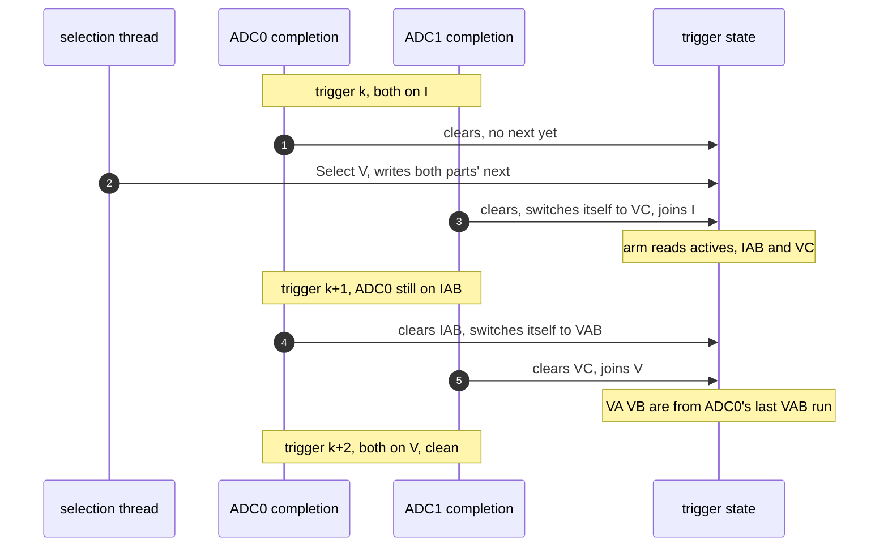

# Batch Join Variants — open decision

Working note, 2026-09-24. Measured, not argued: every result below came from running
`.Test/ADC_Batch_Test.c`. Background and the layering rationale are in `ADC_Reference.md`.

**Question.** Must the join reprogram every part, or can each ADC start its own next sequence at its
own completion? Non-overlapping sequences per ADC is a given.

**Answer.** It can, but not for free, and not by only moving the call. Three rules have to hold
together, and the payoff is smaller than it looks.

---

## Baseline, as committed

`ADC_Trigger_OnComplete_ISR` — each part clears its own markers; the last one to land runs
`ON_COMPLETE`, reprograms **every** part (`_ADC_Batch_ActivateEach`), then arms every part
(`_ADC_Batch_MarkEach`). `ADC_Batch_Select` is one store to `p_Next`. The arm is keyed off the
part's `SEQUENCE_ID`.

---

## What was measured

| Variant | Change | Result |
|---|---|---|
| **A** | per-ADC switch; arm keyed off the part's `SEQUENCE_ID` | 3 failures — **join stalls permanently** |
| **B** | A, but arm keyed off the ADC's own `p_ActiveSequence` | 2 failures — still stalls |
| **C** | B, but the part's switch ordered *before* the arm | 1 failure — no stall, see below |
| **D** | baseline **+** the tail call, join still applies all | PASS |
| **E** | baseline, arm re-keyed to `p_ActiveSequence` | PASS |

A and B are not glitches. The arm names channels the ADC is no longer converting, nothing ever
clears them, and `_ADC_Batch_IsEachComplete` is false forever — the join never fires again.

E is the enabler: the re-keyed arm is compatible with the baseline, so both ISR flavours can share
one set of helpers.

---

## The three rules variant C needs

```c
/* 1. The arm follows the ADC, not the batch */
static inline adc_mask_t _ADC_Batch_PartChannels(const ADC_BatchPart_T * p_part)
    { return p_part->P_ADC->P_STATE->p_ActiveSequence->CHANNELS; }

static inline void ADC_Trigger_OnCompletePart_ISR(ADC_TriggerState_T * p_trigger, ADC_T * p_adc)
{
    assert(p_trigger->p_Active != NULL);

    p_adc->P_STATE->ChannelMarkers &= ~p_adc->P_STATE->p_ActiveSequence->CHANNELS;  /* this part landed */

    /* 2. Its own next set starts here, before the arm. The other parts switched at their own
          completions earlier in this trigger, so by the arm every part is on its next set */
    _ADC_OnCompleteSequenceDma(p_adc->P_HAL_ADC, p_adc->P_STATE);

    if (_ADC_Batch_IsEachComplete(p_trigger->p_Active) == true)
    {
        if (p_trigger->p_Active->ON_COMPLETE != NULL) { p_trigger->p_Active->ON_COMPLETE(p_trigger->p_Active->P_CONTEXT); }

        p_trigger->p_Active = p_trigger->p_Next;    /* the join reprograms nothing */
        _ADC_Batch_MarkEach(p_trigger->p_Active);   /* 3. the arm stays at the join: it is the phase boundary */
    }
}

/* N stores, 1 per part. Each ADC applies its own at its own completion */
static inline void ADC_Batch_SelectParts(ADC_TriggerState_T * p_trigger, ADC_Batch_T * p_batch)
{
    for (uint8_t iPart = 0U; iPart < p_batch->PART_COUNT; iPart++)
        { ADC_SetSequenceDma(p_batch->P_PARTS[iPart].P_ADC, p_batch->P_PARTS[iPart].SEQUENCE_ID); }
    p_trigger->p_Next = p_batch;
}
```

---

## C's one cost: a split set, once, after a straddling selection

Not "stale from the previous cycle" — stale *since that part last ran that sequence*. With `Select`
landing between the two completions of trigger k:

| | ADC0 | ADC1 |
|---|---|---|
| trigger k | converts IAB, clears, no switch yet | converts IC, clears, **switches to VC**, joins |
| join at k | `ON_COMPLETE(I)`: IA IB IC all from k — clean | arm reads actives: IAB and VC |
| trigger k+1 | converts **IAB** still, clears, **switches to VAB** | converts VC, clears, joins |
| join at k+1 | `ON_COMPLETE(V)`: VA VB from ADC0's *last VAB run*, VC fresh from k+1 | |
| trigger k+2 | VAB | VC — clean from here |



In an alternating I/V pattern that is a period or two old; if V runs rarely it is as old as the last
V, and zero before the first. That cycle's fresh IAB values are dropped — no I join fires.

**With the current selection point it cannot happen.** `Board_ADC_Thread` writes from the PWM ISR, at
the trigger instant, above the DMA ISRs, so both parts see the new `next` before either completes
and both switch within the same trigger. The straddle exists only for a selection made from the
1 ms thread, where a DMA ISR can preempt the loop.

---

## What C actually buys

Not earlier conversions. The trigger gates the conversion, not the reprogram — a part reprogrammed
early still waits for the next trigger. Both variants share the same real deadline: the reprogram
must land before the next trigger, and the join runs mid-period with tens of microseconds to spare
at 20 kHz.

What it buys is decoupling: a part's programming stops depending on the other parts' ISRs. That
matters if a part can miss completions, or later if parts sit on different triggers.

---

## The proposal, if we take it

Two entry points over one set of helpers, with the arm re-keyed to `p_ActiveSequence` (variant E
shows the baseline still passes with it):

| Board picks | Switch | Cost |
|---|---|---|
| `ADC_Trigger_OnComplete_ISR` + `ADC_Batch_Select`, 1 store | set-atomic, always | each part's reprogram waits for the last completion |
| `ADC_Trigger_OnCompletePart_ISR` + `ADC_Batch_SelectParts`, N stores | set-atomic unless the selection straddles | one split set when it does |

Also worth taking regardless of the above: **variant D**. `_ADC_OnCompleteSequenceDma` fires the
sequence's own `COMPLETE` callback, which the batch path skips entirely today. Adding the tail call
while the join still applies all makes per-sequence handlers work; the switch there is a no-op,
because `_ADC_Batch_ActivateEach` already left `next == active`.

---

## Reproducing

`.Test/ADC_Batch_Test.c` models the split — IA IB on ADC0, IC VSOURCE on ADC1, one trigger, an
alternating V batch, and a one-part batch. Host build:

```
gcc -std=c23 -Wall -Wextra -I<library> -I<library>/.Test \
    -DHAL_PERIPHERAL_PATH_DIRECTORY=HAL <library>/.Test/ADC_Batch_Test.c -o adc_batch_test
```

The runs above were done by cross-compiling for Cortex-M4 and executing under a Unicorn ARM
emulator, because no host compiler was available on that machine. The emulator harness was scratch
and was not kept; the test file is the artifact.

Note the test's `test_selection_applies_at_the_join` asserts the baseline's semantics — both ADCs
switched by the time the join returns. Under C that assertion is expected to fail; it would need a
variant-specific case that pins the split set instead.
