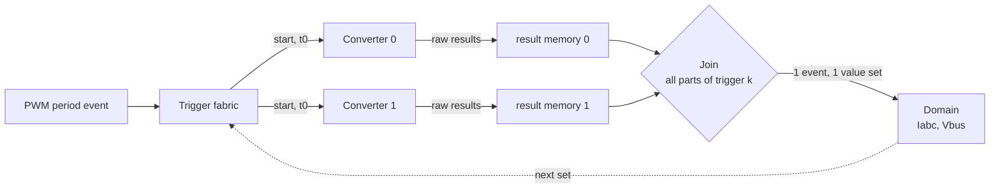
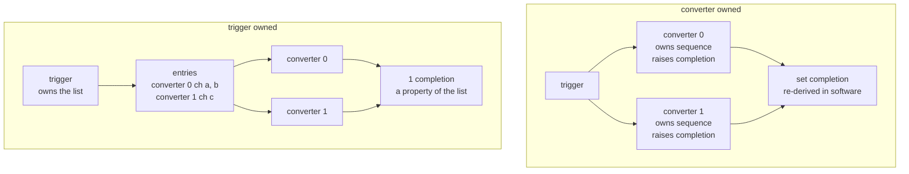
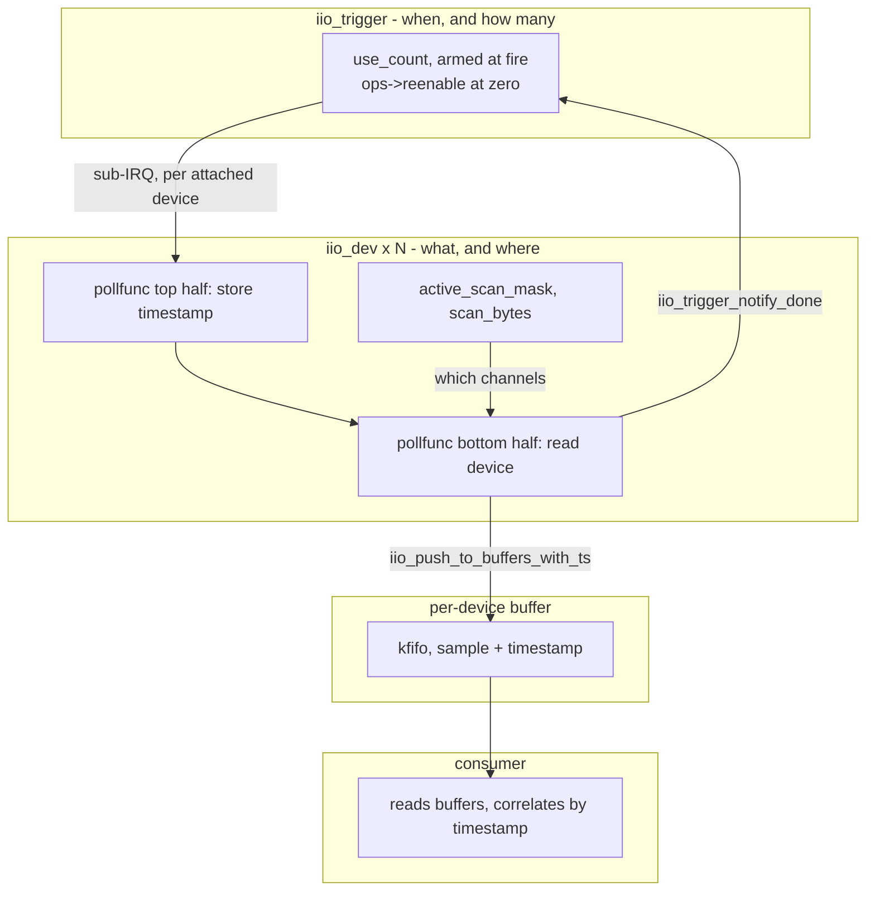
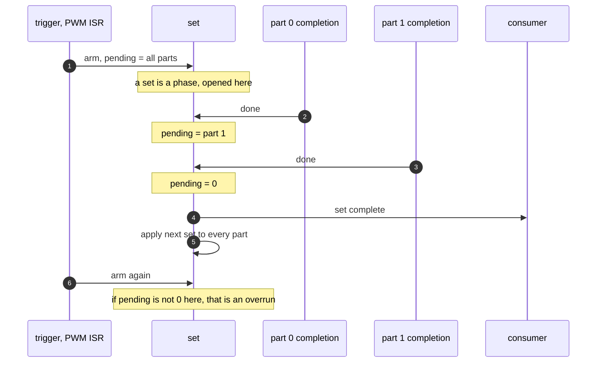
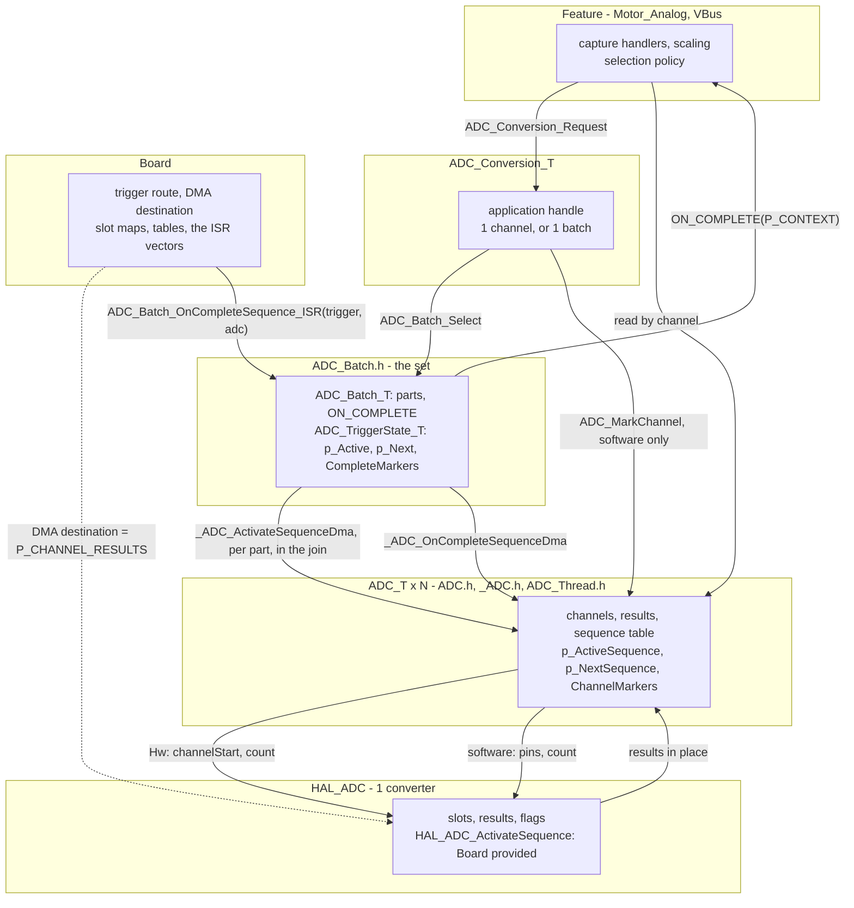
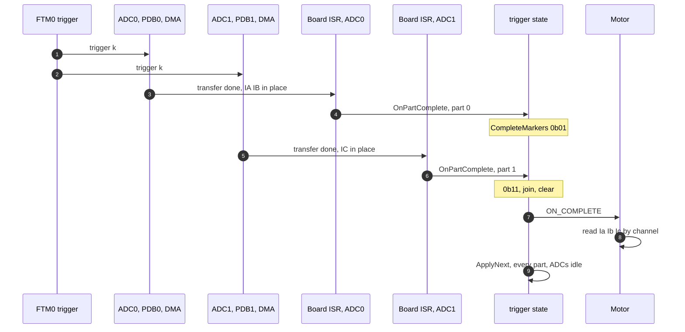

# ADC Set Coordination Reference

Design reference for `ADC.h`, `_ADC.h`, `ADC_Thread.h`, `ADC_Batch.h` and `ADC_Conversion.h`.

How a conversion set spread over several converters is described, completed and switched — and what
keeps the converter driver free of set logic.

Vendor motor-control examples (ST MCSDK, NXP `mcdrv`, TI MotorControl SDK) are left out as interface
models. They reach into the converters' registers from one motor-specific ISR, so there is no
boundary to learn from. The one thing they agree on is repeated below, because it is an invariant
rather than an interface: **one place applies the whole set, and it is the place that consumed the
previous one.**

---

## 1. Five jobs

| Job | Question | Owner |
|---|---|---|
| **Start** | Do the N converters sample at the same instant? | Trigger fabric, in silicon |
| **Sequence** | Which inputs does each converter take on this trigger? | Converter |
| **Transfer** | Where do the results land? | Result registers, FIFO, DMA |
| **Join** | When is *the whole set from trigger k* available? | §4 |
| **Select** | Which set converts next? | §2 |



The dotted edge is the hard part. A selection must reach every converter in the same window, between
the end of trigger k and the start of k+1, or trigger k+1 converts a mix of two sets.

---

## 2. Trigger-owned sets vs converter-owned sets

This is about **which object holds the set**, not about registers.

**Converter-owned.** Each converter owns a sequence and raises its own completion. A set spanning
converters is not represented anywhere; it exists only as a derived concept in the layer above. Every
portable API in §3 is this.

**Trigger-owned.** The set is a first-class object bound to the trigger. Its entries name
*(converter, channel)*. One trigger converts the whole list, and one completion covers it. A
converter is a resource the entries refer to.



Most coordination hardware is built the trigger-owned way. Listed as evidence of the shape, not as an
interface to copy:

| Part | The object that holds the set | Completion |
|---|---|---|
| NXP S32K3 `BCTU` | a **list** bound to a trigger input; entries name an ADC instance and a channel, read as parallel groups across ADC0..ADC2 [[1]](#ref1) [[2]](#ref2) | FIFO watermark over the list |
| NXP i.MX RT `ADC_ETC` | a **trigger group** holding a chain of segments; a sync bit pairs the chain on ADC1 with the one on ADC2 [[3]](#ref3) [[4]](#ref4) | `DONE` per chain |
| Infineon AURIX `EVADC` | the **master group**; slave groups convert with it [[5]](#ref5) [[6]](#ref6) | the master's service request |
| STM32 dual mode | the **master ADC**; its trigger starts the slave | master EOC, results packed in `CDR` |

Linux IIO reaches the same shape in pure software: `iio_trigger` is a first-class object, devices
attach to it, and the trigger — not any device — holds the fan-out and the completion count (§3.1).

**This module is trigger-owned at the set layer.** [ADC_TriggerState_T] belongs to the trigger, and
the batches that alternate on one trigger share it, so only one is ever in flight. Three properties
follow, and they are the reason the layer exists:

- a selection is **one write** (`p_Next`), so batches cannot end up split across a trigger
- the **join applies it**, where every part has landed and its ADCs are idle
- a part of a batch that is no longer active is ignored, so **no join state survives a switch**

Per-ADC selection (`p_NextSequence`, applied by `_ADC_OnCompleteSequenceDma`) remains the mechanism for
a converter used on its own, without a batch — which is exactly the S32K1 case in §7. The two must
not be combined on one converter: for a part, applying at that converter's own completion is a
trigger early. `ADC_Batch_OnCompleteSequence_ISR` asserts `p_NextSequence == p_ActiveSequence` to
keep them apart.

---

## 3. What the generic frameworks define

### 3.1 Linux IIO — the trigger is an object, and the join is a counted barrier

The closest thing to a generic answer for "how does one trigger track N converters" [[7]](#ref7):

```c
void iio_trigger_poll(struct iio_trigger *trig)          /* hard IRQ context */
{
    if (!atomic_read(&trig->use_count)) {                /* still outstanding: drop this event */
        atomic_set(&trig->use_count, CONFIG_IIO_CONSUMERS_PER_TRIGGER);   /* arm */
        for (i = 0; i < CONFIG_IIO_CONSUMERS_PER_TRIGGER; i++) {
            if (trig->subirqs[i].enabled) { generic_handle_irq(trig->subirq_base + i); }
            else                          { iio_trigger_notify_done_atomic(trig); }  /* empty slot self-completes */
        }
    }
}

void iio_trigger_notify_done(struct iio_trigger *trig)   /* each consumer, when its capture is done */
{
    if (atomic_dec_and_test(&trig->use_count) && trig->ops && trig->ops->reenable) { trig->ops->reenable(trig); }
}
```

Five properties, all of them relevant here:

- **The count is armed at the fire point**, not accumulated. A set is a phase, opened by the trigger.
- **The arming value is a compile-time slot count**, not a dynamic attachment count. Slots with no
  consumer complete immediately, in the same loop.
- **Each consumer reports once**, with nothing but "done". It never inspects another consumer.
- **Zero is the re-arm point.** `ops->reenable` runs exactly where the set is complete and the next
  one has not started — the position of `_ADC_Batch_ApplyNext`.
- **A trigger that fires while the previous set is outstanding is dropped.** Overrun is a defined
  outcome, not a silent skew.

What IIO does **not** do: it does not join *data*. Each device pushes its own buffer, and correlation
across devices is left to the consumer, by timestamp — `iio_pollfunc_store_time()` in the top half,
`iio_push_to_buffers_with_ts()` in the bottom half [[8]](#ref8). The counted barrier exists to re-arm
the trigger, not to deliver one value set.


---

## 4. How a set learns that every converter is done

The trigger never asks a converter. Each part **reports**, and the set holds a little state. Two
questions decide the design, and they are independent.

### 4.1 What supplies the phase boundary

> An arrival must be attributable to one trigger instance. Without a boundary, a completion from
> trigger k counts toward trigger k+1 — the classic barrier generation problem.

| # | Mechanism | Boundary from | Set state | Part reports | Needs |
|---|---|---|---|---|---|
| 1 | **Armed count or mask** (IIO) | the arm, at the fire point | 1 mask | "done" | a fire point visible to software |
| 2 | **Generation stamp** | the stamp each arrival carries | mask + generation | "done, as of generation g" | a cheap monotonic period id |
| 3 | **Terminal part** | the designated last arrival | none | only the terminal part reports | config-time completion order |
| 4 | **Hardware aggregation** | the hardware's own sequencing | none | nothing; one completion for the set | the platform to have it (§2) |
| 5 | **Phase separation** | the schedule | none | nothing; results read where they are known complete | a consumer context after the conversions |

- **1 needs a fire point.** When the trigger is routed in silicon (FTM → PDB → ADC), software never
  sees the edge unless an ISR takes it. This design already runs a 20 kHz PWM ISR at the trigger, so
  the arm is one store. Without one, arm at *activation* and rely on "all parts complete before the
  next trigger", which the in-place result buffer already requires.
- **2 needs no fire point and is self-healing.** A part that completes late carries an old stamp and
  is discarded rather than counted. The stamp can be a `uint8_t` incremented in the PWM ISR. It is
  the software form of the timestamp correlation IIO leaves to its consumer.
- **3 has no shared state at all** — no read-modify-write, no shared-priority rule, and no ISR needed
  on the other parts, whose DMA still writes in place. It trades that for an assumption the Board
  must keep true.
- **4 collapses the problem**, and is a capability question a portable driver can ask the HAL.
- **5 is the cheapest and is often overlooked.** A *pull* join needs no new HAL surface: the existing
  `HAL_ADC_ReadConversionCompleteFlag` / `ReadConversionActiveFlag` let a consumer check the set
  itself. Zephyr's blocking `adc_read()` is the synchronous form.



**Overrun must be a defined outcome.** Three policies, all defensible, none of them silent:

| Policy | Meaning | Used by |
|---|---|---|
| Drop the new trigger | the outstanding set finishes; the new event is lost | IIO `use_count` test |
| Drop the stale set | count it, re-arm, keep the newest data | what a control loop usually wants |
| Fault | a part never completing is a sensor or DMA failure | safety paths |

### 4.2 Who runs the join, exactly once

N converters own N execution contexts. The **facts** can always be made race-free — each converter
already produces its own, and either pushes them into the set's word or lets the set pull them. The
**action** — `ON_COMPLETE` plus `ApplyNext` — must run exactly once per phase, and across contexts
that can preempt each other there are exactly three ways to get that:

| Way | Shared write | Cost | Failure if the rule breaks |
|---|---|---|---|
| **Designate the runner** — terminal part, or a polling context | none | zero | wrong designation reads a stale part |
| **Make the contexts non-preempting** — equal NVIC priority | RMW | zero | silent, and **permanent**, see below |
| **Make the write atomic** — critical section | RMW, protected | ~6-10 cycles per part | none |

The module uses the second. Note for the third: **ARMv6-M (M0+) has no LDREX/STREX**, so
`atomic_fetch_or` there becomes a libatomic call that disables interrupts anyway. On an M4/M0+
library, "atomic" *is* `System/Critical`. The shape is claim inside, act outside:

```c
_Critical_Enter(&state);
markers = (p_state->CompleteMarkers |= (1UL << index));
isComplete = (markers == _ADC_Batch_PartMarkers(p_batch));
if (isComplete) { p_state->CompleteMarkers = 0UL; }
_Critical_Exit(state);

if (isComplete) { ... ON_COMPLETE, ApplyNext ... }
```

**Why a lost `|=` is worse than it looks.** It does not cost one cycle of data. Markers never reach
full for trigger k; the next trigger sets the missing bit; the join then fires early on the other
part's previous value, and re-latches the same way every period after. One PWM period of skew,
50 µs at 20 kHz, permanently. A missed trigger or a DMA error leaves the same residue, and no
priority rule prevents those — which is what the arm in §4.1 is for.

A fourth option keeps push without the priority rule: each part stores its own flag (a plain store,
single writer) and pends a spare vector; the join ISR reads all parts. Writing `NVIC->ISPR` is one
store, idempotent and coalescing, and the NVIC will not re-enter the handler concurrently. That is
IIO's top-half / bottom-half split on Cortex-M, and it also fixes something the current design leaves
loose: `ON_COMPLETE` runs Motor capture at whatever priority the last-finishing ADC happens to have,
so its priority changes with batch composition.

---

## 5. This module


Two naming rules carry the layering:

- `_ADC_[Name](p_adc, p_state, ...)` is private and takes the resolved state.
- `ADC_[Name]_ISR(p_adc)` is the outermost call, for the Board to place in the vector.
  `ADC_Batch_[Name]_ISR(p_trigger, p_adc)` is the same shape over a trigger's ADCs.

The Hw and software paths share no protocol, only the type. In the Hw path the sequencer is the
hardware and the transfer is the DMA, so the ADC has no completion work; in the software path the
ADC *is* the sequencer. The one `#if ADC_HW_SEQUENCER_ENABLE` that resolves them lives in the leaf,
`_ADC_SetSequence` and `_ADC_ActivateSequenceDma` are separate leaves, named for the path they serve.
No function dispatches between them: the Board calls the entry its mode provides.



| Layer | Owns | Hands down | Hands up |
|---|---|---|---|
| Board | trigger route, DMA destination, slot maps, tables, vectors | — | the completed ADC and its trigger |
| `HAL_ADC` | one converter's registers and flags | `channelStart, count`, or `pins, count` | raw words, flags |
| [ADC_T] | channel table, `P_CHANNEL_RESULTS`, sequence table, active / next | sequence activation | the sequence that completed |
| [ADC_Batch_T] + [ADC_TriggerState_T] | part list, join markers, active / next batch | `_ADC_ActivateSequenceDma` per part | `ON_COMPLETE(P_CONTEXT)` |
| [ADC_Conversion_T] | nothing, a const view | `ADC_Batch_Select`, `ADC_MarkChannel` | results by channel |
| Feature | scaling, set choice | `ADC_Conversion_Request` | — |

**There is no upward link.** [ADC_T] calls nothing above it and holds no pointer to anything above
it. The Board's ISR is the only place that names both an ADC and the trigger it converts on, and
[ADC_TriggerState_T] is state the ADC never reads. This is the same boundary Zephyr and AUTOSAR draw,
and the same one IIO draws between a device and a trigger.

### 5.1 One trigger, one set of 2 parts



### 5.2 What the trigger state fixed, and what remains

An earlier revision held the selection per ADC and fanned it out from the batch. A selection that
straddled one ADC's completion switched the converters one trigger apart, and left the old batch
holding a marker with no phase to belong to — a permanent one-period skew on its next selection.
**That is structurally gone:** the selection is one write to `p_Next`, the join applies it to every
part where all ADCs are idle, and a part of a non-active batch is ignored.

Two things remain open, both from §4:

1. **No arm.** `CompleteMarkers` accumulates from zero and is cleared at the join. Nothing opens a
   phase, so a lost completion — a dropped RMW, a missed trigger, a DMA error — leaves a residue
   that the next join consumes, permanently (§4.2).
2. **The join is a read-modify-write from N ISRs**, held together by the comment *"Part ISRs must
   share a priority."* That rule is real and load-bearing, and nothing in the code enforces it.

If it stays a rule rather than a mechanism, it can at least be checked once, given the part's `IRQn`
in the part record:

```c
#ifndef NDEBUG
for (uint8_t iPart = 1U; iPart < p_batch->PART_COUNT; iPart++)
    { assert(NVIC_GetPriority(p_batch->P_PARTS[iPart].IRQ_N) == NVIC_GetPriority(p_batch->P_PARTS[0U].IRQ_N)); }
#endif
```

---

## 6. Open design points

Ordered by how much they buy.

1. **Give the set an arm step** — mechanism 1 or 2 of §4.1. `CompleteMarkers` becomes *pending*,
   armed with every part at the fire point (the existing PWM ISR, one store) or at activation,
   rather than accumulated from zero. This is what makes a lost completion recoverable instead of
   permanent, and it makes overrun observable.
2. **Make overrun a counted outcome**, with the policy chosen explicitly (§4.1). For a control loop,
   dropping the stale set and keeping the newest data is usually right.
3. **Choose the join's owner deliberately** (§4.2): designate a terminal part, wrap the RMW in
   `Critical`, or pend a join vector. The current equal-priority rule is the only one of the four
   that is unenforced.
4. **Settle value delivery.** A view over the parts — index → (part, channel) through a const table —
   fits the in-place DMA and costs no copy. A copy only earns its place if the consumer must read
   after trigger k+1's transfer has started. The third option, which AUTOSAR and Zephyr both take, is
   that the consumer supplies the destination, keeping the set out of application storage entirely.
5. **Activation mode per [ADC_T], not per build.** `ADC_HW_SEQUENCER_ENABLE` is global. A board with
   one PWM-synchronous converter and one software-marked converter cannot be expressed. Both
   converters on the S32K1 board are Hw sequenced, so this is a limit, not a defect.

---

## 7. The set is the consumer's completion mask

`ADC_Sequence_T.COMPLETE` fires once, when the set is complete, so a consumer needs no completion
mask of its own. The two paths reach it differently:

- **Hw sequenced** — the transfer completing *is* the set completing. `_ADC_OnCompleteSequenceDma`
  fires it.
- **Software** — the set completes when the last of its channels is captured, which is an edge:
  *this capture held one of the set's channels, and none of them are left*. The remainder alone is a
  level that stays true until the next request re-marks, and would fire on every later completion.

This is what the Motor layer currently does for itself. `Phase_Data_T.Flags` accumulates
`Bits |= 1 << channel` per capture, and `FOC_CaptureIabc` gates on `Flags.Bits == PHASE_ID_ABC`,
carrying the comment *"alternatively use batch callback"* — the same set-completion test, one layer
up, on a mask the consumer has to clear itself. With `COMPLETE`, the handler runs only when Ia, Ib
and Ic are all in the buffer, so it can read them unconditionally.

**One active set per ADC.** `p_ActiveSequence` is a single pointer, so requesting a second sequence
while the first is in flight replaces it, and the first's `COMPLETE` is dropped. That suits sets
that *alternate* — currents while the phases are driven, voltages while floating, which is what
both boards do — and single channels riding along, which carry their own `ADC_Channel_T.CAPTURE`.
It does not suit two sets genuinely pending at once. That needs per-sequence pending state rather
than one pointer: a `PendingSequences` mask in [ADC_State_T], set by `ADC_SetSequence` and cleared
where the set's channels clear, which also removes the need for the edge test.

---

## 8. The S32K1 board: sequence alone

`KAC_N_S32` needs no batch. All the channels a set needs are on one ADC, and the DMA delivers them:

- **ADC1** — 8 slots, FTM0 → TRGMUX → PDB1 → pre-triggers, eDMA copies all 8 into `Adc1Results` on
  completion. In injected mode 2 groups of 4 alternate, selected by the PDB channel enable mask.
- **ADC0** — 6 slots, free-running on its own PDB, no ISR, results polled by the 1 ms thread.

A group *is* a sequence, and the platform hook is the PDB channel write the board already has:
`HAL_PDB_ConfigChannel(p_pdb, channel, offset, count)` and
`HAL_ADC_ActivateSequence(p_hal, channelStart, count)` are the same function.

| Board, by hand | Through the module |
|---|---|
| `BOARD_ADC1_GROUP_I_FIRST` / `_COUNT` | `ADC_SEQUENCE_INIT(ADC_MASK_RANGE(SLOT_IA, 4U))` |
| `BoardAdc1NextGroup`, written by the PWM ISR | `ADC_SetSequenceDma(&ADC1, SEQUENCE_V)`, 1 store to `p_NextSequence` |
| `Board_ADC1_IsGroupI()`, reads the PDB register | `ADC_IsSequenceActive(&ADC1, SEQUENCE_I)`, reads state |
| apply-if-changed in the DMA ISR | `ADC_OnCompleteSequenceDma_ISR` |
| continuous mode, all 8 slots | one sequence, never re-selected |
| ADC0 free-running scan | one sequence, or software-marked channels |

```c
void BOARD_ADC1_DMA_ISR(void)
{
    Board_ADC1_ClearComplete();
    ADC_OnCompleteSequenceDma_ISR(&ADCS[1U]);   /* applies the selection, where the ADC is idle */

    Motor_Analog_CaptureIa(&Motors[0U], ADC_ResultOf(&ADCS[1U], BOARD_ADC1_SLOT_IA));
    /* ... */
}
```

Verified by compiling the ADC1 configuration, the ADC0 software path and a 2-ADC batch against the
real S32K142 platform headers — `arm-none-eabi-gcc 15.2.1`, `-mcpu=cortex-m4 -std=c23 -Wall -Wextra
-O2`, with and without `NDEBUG`. The generated DMA ISR is two loads, a compare, and on change the
`CH[0].C1` / `CH[0].S` / `SC |= LDOK` writes to PDB1, with the board hook's instance select folded
away. Not executed — no emulator in that environment.

One cost worth knowing: the enable mask is computed at runtime from `START` and `COUNT`, about 8
instructions, where `Board_ADC1_ActivateGroupI()` folded to a constant store because its arguments
were literals. Negligible at 20 kHz, but not free.

---

## References

1. <a id="ref1"></a>[NXP community: S32K344 PIT, BCTU parallel ADC, FIFO, DMA](https://community.nxp.com/t5/S32K-Knowledge-Base/Example-S32K344-PIT-BTCU-parallel-ADC-FIFO-DMA-DS3-5-RTD300/ta-p/1732444)
2. <a id="ref2"></a>[NXP community: how BCTU list items work](https://community.nxp.com/t5/S32K/How-BCTU-LIST-items-works/m-p/1570114)
3. <a id="ref3"></a>[NXP community: ADC_ETC sync for ADC1 and ADC2](https://community.nxp.com/t5/MCUXpresso-SDK/ADC-ETC-software-trigger-with-sync-for-both-ADC1-ADC2/td-p/820371)
4. <a id="ref4"></a>[MCUXpresso `fsl_adc_etc.c` (mbed-os mirror)](https://github.com/ARMmbed/mbed-os/blob/master/targets/TARGET_NXP/TARGET_MCUXpresso_MCUS/TARGET_MIMXRT1050/drivers/fsl_adc_etc.c)
5. <a id="ref5"></a>[Infineon: methods for TC3xx EVADC synchronized conversions](https://community.infineon.com/t5/Knowledge-Base-Articles/Methods-for-implementing-AURIX-TC3xx-EVADC-synchronized-conversions/ta-p/1030336)
6. <a id="ref6"></a>[Infineon: iLLD EVADC master/slave example](https://github.com/Infineon/AURIX_code_examples/blob/master/code_examples/iLLD_TC375_ADS_EVADC_Master_Slave_GTM_ATOM_Trig/README.md)
7. <a id="ref7"></a>[Linux `drivers/iio/industrialio-trigger.c`](https://github.com/torvalds/linux/blob/master/drivers/iio/industrialio-trigger.c)
8. <a id="ref8"></a>[Linux IIO triggered buffers](https://docs.kernel.org/driver-api/iio/triggered-buffers.html)
9. <a id="ref9"></a>[Zephyr ADC API](https://docs.zephyrproject.org/latest/doxygen/html/group__adc__interface.html)
10. <a id="ref10"></a>[Zephyr `drivers/adc/adc_context.h`](https://github.com/zephyrproject-rtos/zephyr/blob/main/drivers/adc/adc_context.h)
11. <a id="ref11"></a>[Zephyr RTIO](https://docs.zephyrproject.org/latest/services/rtio/index.html)
12. <a id="ref12"></a>[AUTOSAR CP SWS ADC Driver, R24-11](https://www.autosar.org/fileadmin/standards/R24-11/CP/AUTOSAR_CP_SWS_ADCDriver.pdf)
