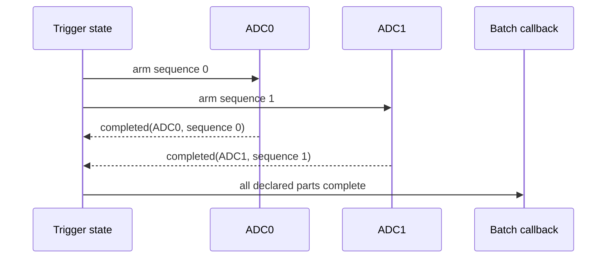
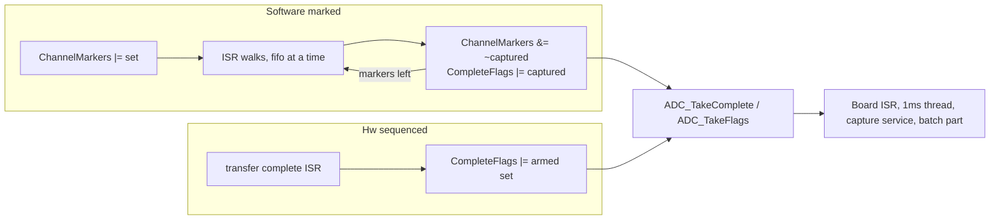

```mermaid
sequenceDiagram
    participant T as Trigger state
    participant A0 as ADC0
    participant A1 as ADC1
    participant B as Batch callback

    T->>A0: arm sequence 0
    T->>A1: arm sequence 1
    A0-->>T: completed(ADC0, sequence 0)
    A1-->>T: completed(ADC1, sequence 1)
    T->>B: all declared parts complete
```

For Uniformity across use cases

```mermaid
flowchart LR
    subgraph SW["Software marked"]
        M["ChannelMarkers |= set"] --> W["ISR walks, fifo at a time"]
        W --> C1["ChannelMarkers &= ~captured<br/>CompleteFlags |= captured"]
        C1 -->|"markers left"| W
    end
    subgraph DMA["Hw sequenced"]
        T["transfer complete ISR"] --> C2["CompleteFlags |= armed set"]
    end
    C1 --> R["ADC_TakeComplete / ADC_TakeFlags"]
    C2 --> R
    R --> B["Board ISR, 1ms thread, capture service, batch part"]
```