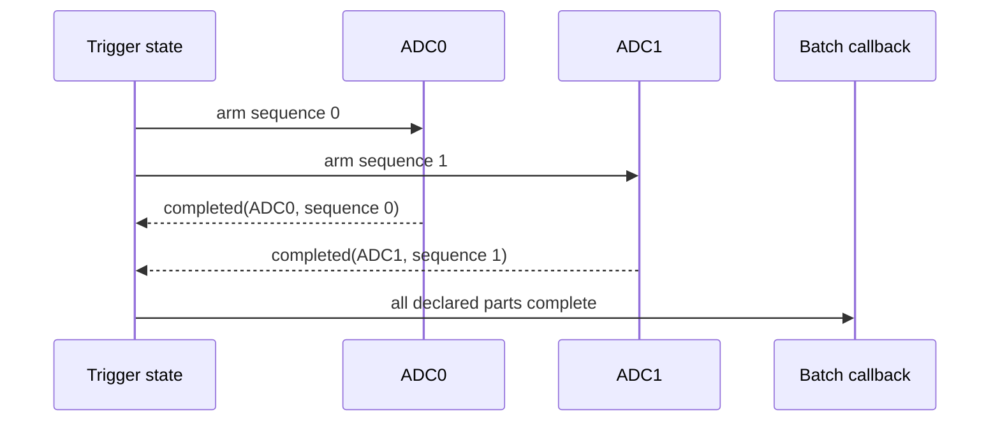

```mermaid
sequenceDiagram
    participant T as Trigger state
    participant A0 as ADC0
    participant A1 as ADC1
    participant B as Batch callback

    T->>A0: arm sequence 0
    T->>A1: arm sequence 1
    A0-->>T: completed(ADC0, sequence 0)
    A1-->>T: completed(ADC1, sequence 1)
    T->>B: all declared parts complete
```