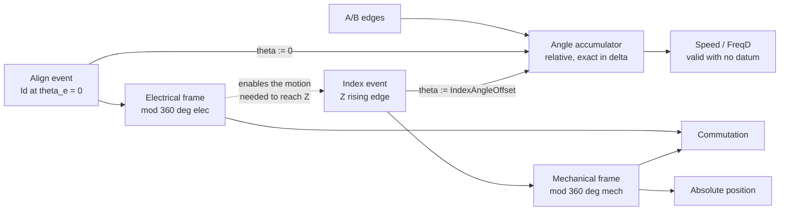
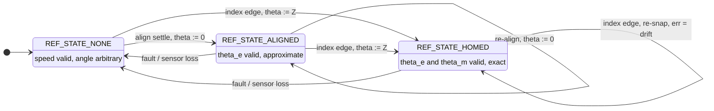
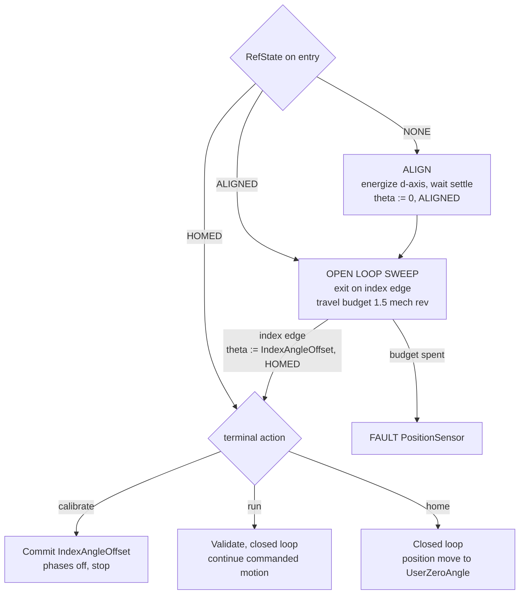
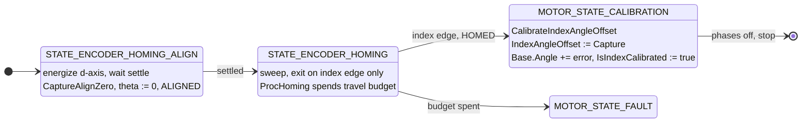
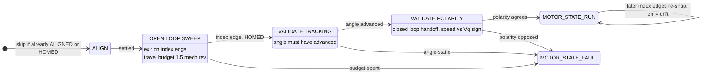
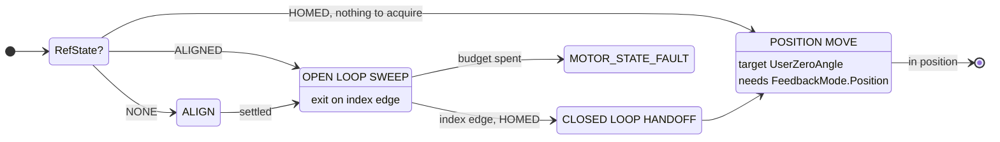
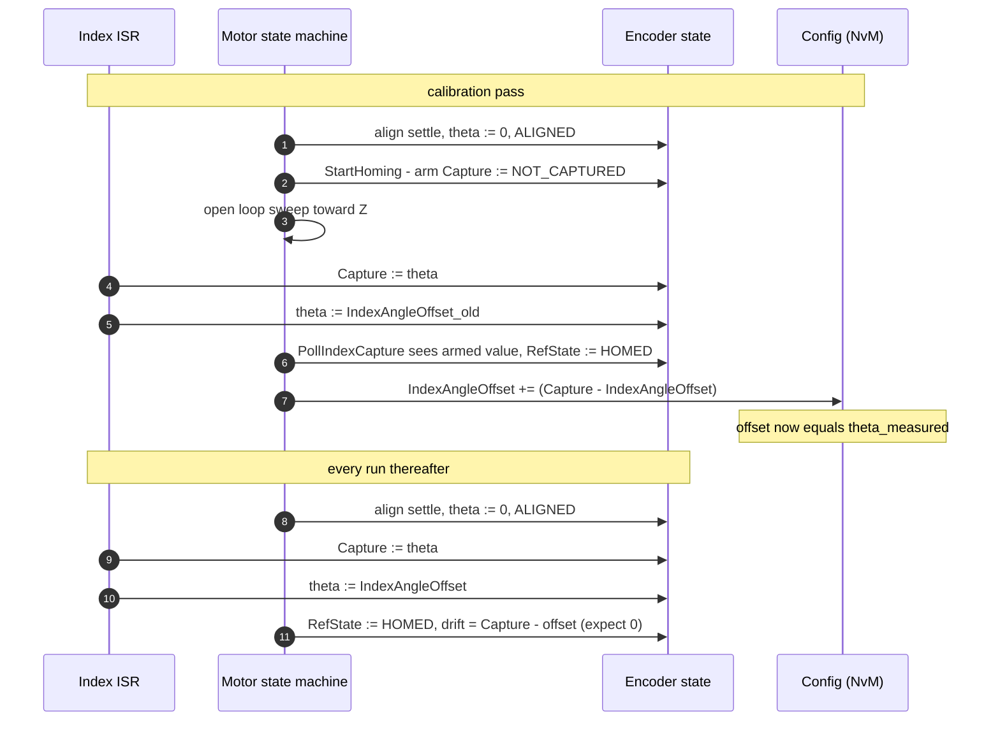

# Encoder Reference Acquisition

Flow reference for `Encoder.c` / `Encoder_ISR.h` and the state machine in
`Motor/Motor/Sensor/Encoder/Motor_Encoder.c`.

An incremental encoder measures change, never position. Every absolute value in the
drive comes from an event that *asserts* a known angle into `AngleCounter.Base.Angle`.
There are two such events, and one acquisition procedure built from them.

---

## 1. Two datums, one dependency

| | Align | Index (Z) |
|---|---|---|
| Asserts | `theta := 0` | `theta := Config.IndexAngleOffset` |
| Mechanism | force `Id` at `theta_e = 0`, rotor d-axis settles | once-per-mechanical-rev marker on `PIN_Z` |
| Valid | mod one **electrical** revolution | mod one **mechanical** revolution |
| Accuracy | approximate — settle position carries cogging, friction and load error | exact — a calibrated constant |
| Unlocks | commutation only | commutation **and** absolute position |
| Costs | moves the rotor, needs current, unusable under load or free-spin | needs motion, which needs commutation you do not yet have |



The dotted edge is why align always precedes the sweep: **index is strictly stronger,
but align is the only datum obtainable from standstill.**

Align is also only *approximate*. That is the second reason to keep sweeping to Z rather
than settling for the align frame — the snap replaces a settle-error-bearing angle with a
calibrated one, and commutation accuracy improves for the rest of the power cycle.

---

## 2. Three reference frames

```
d-axis  : zero at the rotor pole.  Set by Align.                        Read by commutation, 20 kHz.
Index   : zero at the Z marker.    Config.IndexAngleOffset from d-axis. The bridge.
User    : zero at virtual home.    Config.VirtualHomeOffset from Z.     Read by position, per packet.
```

`Base.Angle` stays in the **d-axis frame**. The application zero is a derived constant
applied on read, so the hot path pays nothing and `VirtualHomeOffset` can change at
runtime with no side effects:

```c
UserZeroAngle = Config.IndexAngleOffset + Config.VirtualHomeOffset;   /* on either offset write */

static inline uint16_t Encoder_GetAngle_User(const Encoder_State_T * p_encoder)
{
    return (p_encoder->AngleCounter.Base.Angle - p_encoder->UserZeroAngle) >> ENCODER_ANGLE_SHIFT;
}
```

Two constants, and neither can do the other's job:

- `IndexAngleOffset` — **measured, never chosen.** Fixed by how the encoder was bolted to
  the motor. Conventionally the *commutation offset*.
- `VirtualHomeOffset` — **chosen, never measured.** Arbitrary, user-settable over comms.
  CiA 402 *home offset* (0x607C).

---

## 3. Reference state lattice

Monotonic. Promotion is unconditional; only fault demotes. Written by the polling thread
only — never from an ISR, so a fault demote cannot be lost to an index edge in flight.



`HOMED -> ALIGNED` does not exist. `Encoder_CaptureAlignZero` refuses to run once homed.

---

## 4. One acquisition procedure, three terminal actions

All three use cases run the **same** acquisition: align, then open-loop sweep until Z.
They differ only in what happens after the index edge.



> **Calibration is the exception to the entry gate.** It always runs a fresh align and a
> fresh sweep even when already `HOMED`, because it is *measuring* the offset rather than
> consuming it. Skipping the align would leave the captured angle in no frame at all.

| Terminal action | Align | Sweep exit | Validate | Ends | RefState after |
|---|---|---|---|---|---|
| **Calibrate** | always, never skipped | index edge | none today | commit offset, phases off | `HOMED` |
| **Run** (first time, position unknown) | skip if `ALIGNED` or `HOMED` | index edge | tracking, then polarity | closed loop, `RUN` | `HOMED` |
| **Home** (user command) | skip if `ALIGNED` or `HOMED` | index edge, skipped entirely if `HOMED` | inherits the sweep's | closed loop, then position move | `HOMED` |

---

## 5. Case A — Index calibration

Commissioning. Measures `IndexAngleOffset` and stops; the motor does not continue into a run.



The commit is an assignment, not an accumulation — the measurement *is* the offset, and the
prior value does not participate. A factory zero needs no special case.

```c
int32_t error = Encoder_GetIndexAngleError(p_encoder);   /* Capture - Offset, bind before the commit */

p_encoder->Config.IndexAngleOffset = (uint32_t)p_encoder->IndexAngleCapture;
p_encoder->AngleCounter.Base.Angle += error;
```

`error` exists only for the second line. The ISR snapped `Base.Angle` to the *old* offset at
the index edge, so the live angle trails the committed frame until the next Z; carrying the
error over fixes that. Bind it before the commit — the commit is what makes it zero.
`Capture` itself needs no adjustment: the error re-reads as 0 automatically.

---

## 6. Case B — Normal run, first time, position unknown

The sweep **is** the start-up ramp, not a blocking search: the machine is moving and
producing torque throughout. Staying open loop until Z means closed loop begins with an
exact commutation angle instead of the align settle estimate.



Once `HOMED`, subsequent starts in the same power cycle skip the whole chain — align and
sweep both. This runs **once per power-on**, not on every start.

### If the encoder has no Z channel

Then `ALIGNED` is the ceiling and the sweep must exit on a **timer** instead, accepting
the align settle error as the permanent commutation reference. This is the one
configuration where the sweep does not end at an index edge.

---

## 7. Case C — User command: go to virtual home

Same acquisition as Case B; different terminal action. No offset commit — it consumes
`IndexAngleOffset`, it does not measure it.



The position move waits on closed loop position control. `FeedbackMode.Position` exists
as a bit, but `PidPosition` is commented out and there is no
`MOTOR_FEEDBACK_MODE_POSITION` preset.

---

## 8. Index ISR and the polling thread

The ISR does two stores, no branch, no mode dispatch. It captures raw and interprets
nothing; every interpretation happens in the polling thread.

```c
/* polling thread, Encoder_StartHoming - arms the capture */
p_encoder->IndexAngleCapture = ENCODER_INDEX_NOT_CAPTURED;

/* ISR - two stores */
static inline void Encoder_CaptureIndex(Encoder_State_T * p_encoder)
{
    p_encoder->IndexAngleCapture       = p_encoder->AngleCounter.Base.Angle;
    p_encoder->AngleCounter.Base.Angle = p_encoder->Config.IndexAngleOffset;
}
```

**Why there is no third store.** The ISR writes two fields from one input; together they
reconstruct exactly one fact and nothing more. A latch is a *third* bit of information, so
the choice is only ever to spend a third store or to reserve one value out of the two
already written. The angle domain has no spare encoding space to reserve accidentally —
`angle32_per_count(cpr) = UINT32_MAX / cpr + 1` rounds up, so low bits are not
structurally zero, and every `int32_t` pattern is a legal angle. Hence the armed sentinel.



`Encoder_PollIndexCapture` runs from `Encoder_RotorSensor_CaptureSpeed` on **every** path,
not only while searching — so an index edge reached outside a deliberate sweep promotes
the same way. Only the travel budget belongs to the search.


